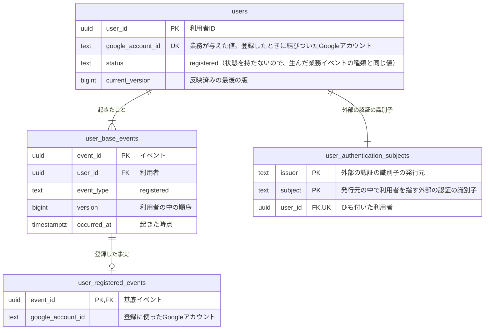

# アカウントのコマンドデータモデル

運営者が「誰が、いつ、どのGoogleアカウントで利用者として登録したか」を後から説明できるように、利用者として登録した事実を利用者ごとに積み、一つのGoogleアカウントから一人の利用者しか生まれないことを行で守る。あわせて、ログインの仕組みが発行する外部の認証の識別子と利用者のひも付けを、登録と同じ一回の変更で残す。認証の仕組みの管理APIが止まっても、登録済みの利用者がこのひも付けで業務を続けられるようにするためである。

この業務には、同期で行うと問題が起きる処理が無い。登録で行う外部への確認（Googleアカウントの持ち主であるかの確認）は、登録を成立させる前に済ませる判断であり、成立した後に頼む処理ではないので、Outboxで分けない。

## 利用者を一人ごとのリソースにし、登録した事実を積む

| 系列 | 性質 | 論理テーブル | 保存表現 | 根拠 |
|---|---|---|---|---|
| リソース系 | 業務 | `users` | 現在状態 | 業務知識「利用者」「利用者とGoogleアカウントの結びつき」 |
| イベント系 | 業務 | `user_base_events` | イベント列 | 業務知識「誰が、いつ、どのGoogleアカウントで利用者として登録したかを後から説明できる」 |
| イベント系 | 業務 | `user_registered_events` | イベント列 | 業務イベント「利用者として登録した」 |
| リソース系 | 技術 | `user_authentication_subjects` | 現在状態 | 非機能要件「信頼性」認証の仕組みの管理APIが止まっても登録済み利用者が業務を続けられる、「セキュリティ」自己申告の利用者IDを信頼しない |

利用者はイベント列を選んだ。業務知識が、誰がいつどのGoogleアカウントで利用者として登録したかを後から説明できることを求めているからである。初期リリースで利用者に起きる業務イベントは「利用者として登録した」だけだが、事実の列として積んでおけば、後から退会や付け替えのような業務イベントが加わっても、登録の事実を書き換えずに足していける。業務知識は利用者を状態を持たないとしているので、`users`の`status`は基底イベントの種類と同じ`registered`、`current_version`は1にした。どちらも型が決めた要素で、イベントから導けるが外さない。

リソースは利用者一人にした。利用者IDが変わらないこと、Googleアカウントとの結びつきが登録したときに決まって変わらないことは、一人の利用者の行で判定できるからである。一つのGoogleアカウントからは一人の利用者しか生まれないという決まりは、同じ`google_account_id`を持つ`users`の行の集まりにまたがるので、競合する行の組としてBDD-002で示す。Googleアカウントを別のリソースにしなかったのは、業務の人がGoogleアカウントを利用者と別に追い続ける物として語らず、利用者が登録したときに与えられた値として扱うからである。

外部の認証の識別子とのひも付けは、業務の決まりではないが、後から導けず、失うと登録済みの利用者が誰であるかを決められなくなる技術のデータである。そのため性質を「技術」とした現在状態のテーブルに置いた。業務のリソースではないので`status`と`current_version`は持たない。

メールアドレスは記録しない。業務知識は、同じ利用者かどうかをメールアドレスで決めないとしており、記録しなくても誰も判断に困らないからである。ログインした回数や最後にログインした日時も、業務知識がログインを業務イベントを起こさないクエリとしているので記録しない。

作成、更新、削除のうち、この資料が扱うのは作成だけである。初期リリースには利用者を変える業務イベント（退会、強制退会、付け替え）が無いので更新は無い。成立した業務イベントは期間にかかわらず削除しないと要件が定め、利用者の削除の条件も業務で決まっていないので、削除も無い。

## コマンドデータモデル図



## テーブル定義

### `users`（利用者）

一行が、Googleアカウントで利用者として登録した一人を表す。`user_id`は登録したときにこのサービスが付けた利用者IDで、以後変わらない。`google_account_id`は、登録したときに本人確認されたGoogleアカウントを見分けるための値で、業務が与えた値である。初期リリースには付け替えが無いので、登録した後に変わらない。ほかの業務は、誰のポストか、誰が誰をフォローしているか、その利用者が存在するかを、この表の`user_id`で指す。

#### 業務制約: 一つのGoogleアカウントに結びつく利用者は一人

同じ`google_account_id`を持つ`users`の行は一つしか無い（BDD-002、BDD-003）。

#### 業務制約: 利用者は登録の事実と一緒にだけある

`users`の行があれば、同じ`user_id`で`event_type`が`registered`の`user_base_events`の行と、それを指す`user_registered_events`の行がある。どちらかだけの行は無い（BDD-001）。

#### 業務制約: 現在の版は最後のイベントの版

`current_version`は、その利用者の`user_base_events`の最大の`version`と等しい。初期リリースでは常に1である（BDD-001）。

### `user_base_events`（利用者に起きたこと）

利用者に起きた業務イベントのうち、どの種類にも共通する事実を一行ずつ積む。`user_id`と`version`の組は一意である。登録日時は`registered`の行の`occurred_at`で表す。

### `user_registered_events`（利用者として登録した）

利用者として登録したことに固有の事実として、登録に使ったGoogleアカウントを持つ。`users`の`google_account_id`と同じ値だが、`users`の値は利用者のいまの結びつきを、この表の値は登録したときに使ったGoogleアカウントという起きた事実を表す。初期リリースでは両者は変わらず一致するが、付け替えが加わったときに登録の事実を書き換えずに済むよう、事実の側にも持たせた。この重なりは仮説であり、未決に書いた。

### `user_authentication_subjects`（外部の認証の識別子とのひも付け）

一行が、ログインの仕組みが発行する外部の認証の識別子一つと、それが指す利用者のひも付けを表す。`issuer`はどの発行元の識別子かを、`subject`はその発行元の中で利用者を指す識別子を表し、二つの組で一行が決まる。利用者として登録するのと同じ一回の変更で一行を足す。ログインでは、確かめた外部の認証の識別子からこの表で利用者を決め、要求の中の自己申告の利用者IDでは決めない。

#### 業務制約: 一つの外部の認証の識別子は一人の利用者にだけひも付く

同じ`issuer`と`subject`の組の行は一つしか無い（BDD-002）。

#### 業務制約: 一人の利用者にひも付く外部の認証の識別子は一つ

同じ`user_id`の行は一つしか無い（BDD-001）。認証の仕組みの側で利用者が作り直された場合の回復は初期リリースの対象外なので、一人に二つ目の識別子が付く場面が無い。

## 並行実行で必要な保証

同時に進むと結果が変わる組は一つで、BDD-002で行を示した。同じGoogleアカウントから利用者として登録するのが同時に二つ届くと、先に記録された一つだけが成立する。後から記録しようとした側は、同じ`google_account_id`の`users`の行と、同じ`issuer`と`subject`の`user_authentication_subjects`の行が先にあるので、利用者、登録の事実、ひも付けのどれも一行も増えない。競合するのは、一人の利用者の行ではなく、同じ`google_account_id`を持つ`users`の行の集まりと、同じ組の`user_authentication_subjects`の行である。

初期リリースには利用者を更新する業務イベントが無いので、古い版に基づく書き込みが起きる場面は無い。

## 業務知識のBDDとの対応

| 業務知識のBDD | この資料のBDD |
|---|---|
| BDD-001 | BDD-001 |
| BDD-002 | 対象外 |
| BDD-003 | BDD-003 |
| BDD-004 | 対象外 |
| BDD-005 | 対象外 |
| BDD-006 | クエリデータモデル |
| BDD-007 | クエリデータモデル |
| BDD-008 | クエリデータモデル |
| BDD-009 | クエリデータモデル |
| BDD-010 | BDD-002 |

業務知識のBDD-002（メールアドレスが同じでも別のGoogleアカウントなら別の利用者が生まれる）は、この資料のBDD-001と同じく、利用者、基底イベント、詳細イベント、ひも付けを一行ずつ足す変化にしかならない。メールアドレスを記録しないので、既存の利用者と行の上で区別する必要も無い。業務知識のBDD-004（LINEでは登録できない）とBDD-005（本人確認されていないGoogleアカウントでは登録できない）は、本人確認の段階で拒まれて記録に届かない。

## 未決

`user_registered_events`の`google_account_id`は、`users`の`google_account_id`と初期リリースの間は常に同じ値になる。付け替えが業務に加わったときに登録の事実を書き換えないために持たせた仮説である。採らなかった案は、詳細イベントに固有の事実を持たせず、`users`だけに持つ案である（付け替えが加わった時点で、登録したときのGoogleアカウントが分からなくなる）。付け替えを業務に加えるかは、要件の持ち主（利用者）に確かめる。

外部の認証の識別子の正確な項目（どの項目を`issuer`と`subject`に写すか）と、Googleアカウントを見分ける値の正確な項目は、要件自体が「公式仕様と契約テストで確定する」としており未決である。

ほかの業務のコマンドデータモデルはまだ置かれておらず、`users`を読む側の参照は照合していない。

## BDD

### [BDD-001] 利用者として登録すると、利用者、登録の事実、外部の認証の識別子とのひも付けが一緒に生まれる

```gherkin
Given: 利用希望者は、Googleアカウント G-1001 の持ち主として本人確認されており、外部の認証の識別子は発行元 https://auth.example.com の sub-1001 である
  And: Googleアカウント G-1001 と外部の認証の識別子 sub-1001 は、どの利用者にも結びついていない
When: 利用希望者が2026年10月1日 10:00にGoogleアカウント G-1001 で利用者として登録する
Then: 利用者 U-0001 が生まれ、登録の事実とひも付けが同じ変更で積まれる
  And: 利用者 U-0001 の版は1である
```

#### データの状態

**Before**

**`users`**

| user_id | google_account_id | status | current_version |
|---|---|---|---|
| （行なし） | | | |

**`user_base_events`**

| event_id | user_id | event_type | version | occurred_at |
|---|---|---|---|---|
| （行なし） | | | | |

**`user_registered_events`**

| event_id | google_account_id |
|---|---|
| （行なし） | |

**`user_authentication_subjects`**

| issuer | subject | user_id |
|---|---|---|
| （行なし） | | |

**After**

**`users`**

| user_id | google_account_id | status | current_version |
|---|---|---|---|
| **U-0001** | **G-1001** | **registered** | **1** |

**`user_base_events`**

| event_id | user_id | event_type | version | occurred_at |
|---|---|---|---|---|
| **E-001** | **U-0001** | **registered** | **1** | **2026年10月1日 10:00** |

**`user_registered_events`**

| event_id | google_account_id |
|---|---|
| **E-001** | **G-1001** |

**`user_authentication_subjects`**

| issuer | subject | user_id |
|---|---|---|
| **https://auth.example.com** | **sub-1001** | **U-0001** |

### [BDD-002] 同じGoogleアカウントの登録が先に記録されていると、同時に届いたもう一つの登録は何も増やさない

```gherkin
Given: Googleアカウント G-5005 の持ち主から、利用者として登録するのが2026年10月6日 10:00に同時に二つ届いた
  And: 一つ目の登録が先に記録され、利用者 U-0005 が生まれた
  And: 二つ目の登録は、Googleアカウント G-5005 がどの利用者にも結びついていないと読んで判断された
When: 二つ目の登録を、利用者 U-0006 として記録する
Then: 利用者 U-0006 は記録されない
  And: 登録の事実とひも付けも増えず、利用者 U-0005 の行は変わらない
  NOTE: Rule: 利用者に結びついたGoogleアカウントで登録する
    Reason: 一つのGoogleアカウントに結びつく利用者は一人
```

#### データの状態

**Before**

**`users`**

| user_id | google_account_id | status | current_version |
|---|---|---|---|
| U-0005 | G-5005 | registered | 1 |

**`user_base_events`**

| event_id | user_id | event_type | version | occurred_at |
|---|---|---|---|---|
| E-005 | U-0005 | registered | 1 | 2026年10月6日 10:00 |

**`user_registered_events`**

| event_id | google_account_id |
|---|---|
| E-005 | G-5005 |

**`user_authentication_subjects`**

| issuer | subject | user_id |
|---|---|---|
| https://auth.example.com | sub-5005 | U-0005 |

**After**

**`users`**

| user_id | google_account_id | status | current_version |
|---|---|---|---|
| U-0005 | G-5005 | registered | 1 |

**`user_base_events`**

| event_id | user_id | event_type | version | occurred_at |
|---|---|---|---|---|
| E-005 | U-0005 | registered | 1 | 2026年10月6日 10:00 |

**`user_registered_events`**

| event_id | google_account_id |
|---|---|
| E-005 | G-5005 |

**`user_authentication_subjects`**

| issuer | subject | user_id |
|---|---|---|
| https://auth.example.com | sub-5005 | U-0005 |

### [BDD-003] 利用者に結びついたGoogleアカウントで後日もう一度登録しても、何も増えない

```gherkin
Given: 利用者 U-0001 は、2026年10月1日 10:00にGoogleアカウント G-1001 で登録した
  And: Googleアカウント G-1001 の持ち主は、G-1001 の持ち主として本人確認されている
When: Googleアカウント G-1001 の持ち主が2026年10月3日 10:00に再び利用者として登録する
Then: 新しい利用者は記録されない
  And: 利用者 U-0001 の行、登録の事実、ひも付けは変わらない
  NOTE: Rule: 利用者に結びついたGoogleアカウントで登録する
    Reason: 一つのGoogleアカウントに結びつく利用者は一人
```

#### データの状態

**Before**

**`users`**

| user_id | google_account_id | status | current_version |
|---|---|---|---|
| U-0001 | G-1001 | registered | 1 |

**`user_base_events`**

| event_id | user_id | event_type | version | occurred_at |
|---|---|---|---|---|
| E-001 | U-0001 | registered | 1 | 2026年10月1日 10:00 |

**`user_authentication_subjects`**

| issuer | subject | user_id |
|---|---|---|
| https://auth.example.com | sub-1001 | U-0001 |

**After**

**`users`**

| user_id | google_account_id | status | current_version |
|---|---|---|---|
| U-0001 | G-1001 | registered | 1 |

**`user_base_events`**

| event_id | user_id | event_type | version | occurred_at |
|---|---|---|---|---|
| E-001 | U-0001 | registered | 1 | 2026年10月1日 10:00 |

**`user_authentication_subjects`**

| issuer | subject | user_id |
|---|---|---|
| https://auth.example.com | sub-1001 | U-0001 |
