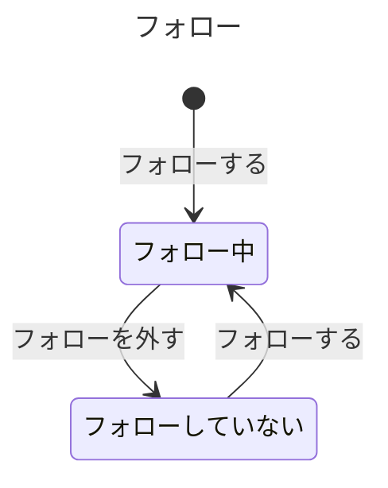

# フォローの業務知識

利用者と作り手が、誰が誰をフォローしてよいか、いつフォローを外せるか、何人までフォローできるかを同じ言葉で判断するための業務知識である。フォローは利用者が読みたい相手をフォローしたときに始まり、その相手のフォローを外したときに終わる。外した相手は、また何度でもフォローできる。

# 概要

フォローは、利用者が読みたい相手を自分で選び、その相手のポストを自分のホームタイムラインに届く対象にし、要らなくなったら外す業務である。何が届くかを利用者自身が選べることが、この業務が守りたい価値である。だから、フォローを始めるのも外すのも本人だけで、他人が誰かの代わりに相手を選べない。一人がフォローできる相手には5,000人の上限を置き、同じ相手を二重にフォローさせない。

相手を探すために、利用者は登録済みの利用者の一覧を見て、それぞれの相手が本人か、フォロー中か、フォローしていないかを確かめられる。

利用者の登録と利用者IDの決め方はアカウントの業務が担う。この業務は、登録済みの利用者を所与として扱う。フォローした結果、相手のどのポストがホームタイムラインに表示されるかは、ホームタイムラインの業務が決める。フォローの変化がホームタイムラインへ反映されるまでの時間差は、仕組みの話なのでこの業務の決まりではない。

この業務の中では、フォローするとフォローを外すがコアである。利用者が何を読めるかというプロダクトの中心を、この二つの行いが決めるからである。相手を探す一覧は、フォローする相手を見つける助けで、表示対象の決まりが単純なので支援とした。

# ユビキタス言語

業務の言葉と英名の対応は次のとおりである。英名は業務の言葉を英語にした名前で、実装の名前はこれに従う。業務イベントは起きたことなので、英名も過去形にする。利用者、利用者ID、ポスト、ホームタイムラインは、それを作り変える業務の資料が持ち主で、この資料は同じ言葉と英名で使う。

| 業務の言葉 | 英名 | 種類 | 持ち主 |
|---|---|---|---|
| 利用者 | User | 業務用語 | [アカウントの業務知識](../アカウント/business-knowledge.md) |
| 利用者ID | UserId | 業務用語 | [アカウントの業務知識](../アカウント/business-knowledge.md) |
| ポスト | Post | 業務用語 | [ポストの業務知識](../ポスト/business-knowledge.md) |
| ホームタイムライン | HomeTimeline | 業務用語 | [ホームタイムラインの業務知識](../ホームタイムライン/business-knowledge.md) |
| フォロー | Follow | 業務用語 | この資料 |
| フォロワー | Follower | 業務用語 | この資料 |
| フォロー中の相手 | Followee | 業務用語 | この資料 |
| フォロー中 | Following | 業務用語 | この資料 |
| フォローしていない | NotFollowing | 業務用語 | この資料 |
| フォロー中の人数 | FollowingCount | 業務用語 | この資料 |
| フォロー上限 | FollowLimit | 業務用語 | この資料 |
| フォローした | Followed | 業務イベント | この資料 |
| フォローを外した | Unfollowed | 業務イベント | この資料 |
| フォローする | FollowUser | コマンド | この資料 |
| フォローを外す | UnfollowUser | コマンド | この資料 |
| フォローする相手を探す | FindUsersToFollow | クエリ | この資料 |

## 業務用語

### フォロー

一人の利用者が、別の一人の利用者のポストを読みたいと選んでいることである。フォローはフォロワーとフォロー中の相手の二人の間に一つだけあり、フォロー中かフォローしていないかのどちらかにある。外した後にまたフォローしても、同じ二人の間のフォローがフォロー中に戻るだけで、フォローが二つになることはない。

### フォロワー

フォローを始めた側の利用者である。フォローを始めるのも外すのも、フォロワー本人だけである。

### フォロー中の相手

フォロワーがフォロー中のフォローの、もう一方の利用者である。フォロワーのホームタイムラインに、この相手のポストが表示される。相手の側が何かを承認することはなく、相手はフォローされることを拒めない。

### フォロー中の人数

一人のフォロワーの、フォロー中のフォローの数である。フォローしていないフォローは数えない。フォローできるかを、フォロー上限と比べて判断するために使う。

### フォロー上限

一人のフォロワーが同時にフォロー中でいられる相手の数の上限で、5,000人である。

## 業務イベント

### フォローした

フォロワーが相手をフォローした。二人の間のフォローがフォロー中になり、フォロワーのフォロー中の人数が一人増える。

### フォローを外した

フォロワーがフォロー中の相手のフォローを外した。二人の間のフォローはフォローしていないになり、フォロワーのフォロー中の人数が一人減る。

# 概念

## フォロー

フォローは、フォロワーと相手の二人の間の、読みたいという選択である。フォローした時に始まり、フォローを外した時に終わる。終わったフォローはまた始められ、そのたびに新しい「フォローした」が起きる。前のフォローの時点や経緯は、次のフォローに引き継がない。フォローがフォロー中かどうかは、その二人の間で最後に起きたのが「フォローした」か「フォローを外した」かで決まる。

## フォロー中の相手の顔ぶれ

一人のフォロワーが、いま誰をフォロー中かは、そのフォロワーのすべてのフォローを見て初めて分かる。一つのフォローの中には無い。フォローできるかは、この顔ぶれ（同じ相手がすでに入っていないか、人数が上限に達していないか）で決まる。

# 常に守られること

### 一人のフォロワーが同じ相手をフォロー中なのは、一つのフォローだけである

同じ相手へのフォローが二つあると、一つを外しても相手のポストが届き続け、利用者は外したはずの相手を外せなくなる。

### 一人のフォロワーのフォロー中の人数は、5,000人を超えない

上限を超えてフォローを重ねられると、一人の利用者のホームタイムラインに届く相手が際限なく増え、フォローを目安に読む相手を選ぶという使い方が成り立たなくなる。

### 利用者は自分をフォローしない

フォローは自分以外の読みたい相手を選ぶことである。自分へのフォローを認めると、フォロー中の人数が相手を選んでいないのに減り、上限の意味がずれる。

### 誰がいつ誰をフォローし、いつ外したかを、起きた順に後から説明できる

利用者から「フォローした覚えがない」「外したはずの相手のポストが見える」と問われたとき、サービスを運営する側は、その利用者に起きたフォローとフォローを外したことを順に示して答える。説明できなければ、ホームタイムラインの表示がなぜそうなっているかを利用者に示せない。拒まれたフォローとフォローを外すことは起きていないので、説明の対象にしない。誰が説明するかは仮説で置いた（まだ決まっていないことを参照）。

# 状態と、その移り変わり

## フォローは外してもまた始められる



終わりの状態は無い。フォローしていないフォローは、フォロワーがまたフォローすればフォロー中に戻る。一度もフォローしたことの無い二人の間にはフォローが無く、利用者から見ればフォローしていないのと同じである。

フォロー中はフォロワーが「フォローしている」と言う状態で、フォローしていないは、外した後の状態である。

# 業務の行い

## コマンド

### フォローする

フォロワー本人だけがフォローできる。他人が誰かの代わりにフォローできると、その人のホームタイムラインに望まない相手のポストが届き、フォロー上限まで勝手に使われる。

フォローできるのは、相手が登録済みの利用者で、自分ではなく、その相手をまだフォロー中でなく、フォロー中の人数がフォロー上限の5,000人未満のときである。4,999人をフォロー中なら5,000人目をフォローでき、5,000人をフォロー中なら5,001人目はフォローできない。フォローしていない相手には、前にフォローを外したことがあってもフォローできる。フォローすると二人の間のフォローがフォロー中になり、「フォローした」が起きる。

操作の回数の上限（フォローとフォローを外すの合計で20回/分、100回/日）は、業務の判断ではなく負荷を抑えるための値なので、品質要求（非機能要件の負荷保護）に置いた。

#### 拒む理由: 他人としてフォローする

誰の代わりにでもフォローできると、読む相手を本人が選ぶという、この業務の価値が失われる。

#### 拒む理由: 自分をフォローする

フォローは自分以外の読みたい相手を選ぶことである。

#### 拒む理由: 登録されていない利用者をフォローする

登録済みの利用者でない相手には、読むポストが無く、フォローしても何も届かない。

#### 拒む理由: フォロー中の相手をフォローする

同じ相手へのフォローを二つ作ると、外しても相手のポストが届き続ける。

#### 拒む理由: フォロー上限に達している利用者がフォローする

5,000人を超えてフォローさせると、一人のフォロー中の人数に上限を置いた意味がなくなる。

### フォローを外す

フォロワー本人だけが外せる。他人が誰かの代わりに外せると、その人が読みたくて選んだ相手のポストが、本人の知らないうちに届かなくなる。

外せるのは、その相手をフォロー中のときである。外すと二人の間のフォローはフォローしていないになり、「フォローを外した」が起きる。外すとフォロー中の人数が一人減るので、フォロー上限に達していた利用者も、また別の相手をフォローできる。

#### 拒む理由: 他人としてフォローを外す

誰の代わりにでも外せると、本人が選んだ相手が本人の知らないうちに外れる。

#### 拒む理由: フォローしていない相手のフォローを外す

フォローしていない相手には、外すフォローが無い。拒んだときは何も変わらない。

## クエリ

### フォローする相手を探す

利用者なら誰でも探せる。探した結果の、本人・フォロー中・フォローしていないの区別は、探した利用者本人から見た区別である。

表示するのは、登録済みの利用者すべてで、探した本人も含む。それぞれの利用者について、探した本人か、探した本人がフォロー中の相手か、フォローしていない相手かを示す。フォローを外した相手と、一度もフォローしたことの無い相手は、どちらもフォローしていないと示す。相手が探した本人をフォローしているかは、この区別に影響しない。非公開アカウントとブロックは扱わないので、一覧から外す利用者はいない。

並び（利用者IDの順）と一回に返す件数は、どの利用者を表示するかを変えないので、API の契約に置いた。

# 導出されること

フォロー中の人数は、そのフォロワーのフォローのうち、フォロー中のものの数である。

フォローする相手を探したときの区別は、次のように一つに決まる。相手が探した本人なら本人である。そうでなく、探した本人から相手へのフォローがフォロー中ならフォロー中である。それ以外はフォローしていないである。

# 同時に起きたとき

### 同じ相手を同時に二回フォローする

先に受け付けた方だけがフォローになる。後の方は、その時点でフォロー中の相手をフォローすることになるので拒む。一人のフォロワーが同じ相手をフォロー中なのは、一つのフォローだけだからである。

### フォロー中の人数が4,999人の利用者が、二人を同時にフォローする

先に受け付けた一人だけをフォローできる。フォロー中の人数は5,000人を超えないからである。

### 同じフォローを同時に二回外す

先に受け付けた方だけが外れる。後の方は、フォローしていない相手のフォローを外すことになるので拒む。「フォローを外した」は一度だけ起きる。

# まだ決まっていないこと

「後から説明できる」ことを誰が何のために使うかは、要件に書かれていない。サービスを運営する側が利用者の問いに答えるため、という仮説で置いた。採らなかった案は、利用者本人が自分で履歴を見るためとする案で、履歴を見るクエリは要件に無いので採らなかった。確かめる相手は要件を決めた利用者（プロダクトの持ち主）である。

フォローする相手を探す一覧の、一回に返す件数と続きの読み方は、要件に無い。業務の判断を変えないので API の契約で決める。
# BDD

ここまでの決まりが、具体の場面でどう働くかを示す。**ここに上で書いていない決まりを持ち込まない。**

## フォローする

### [BDD-001] 誰もフォローしていない利用者が相手をフォローするとフォロー中になる

```gherkin
Given: 利用者 U-0001 は誰もフォローしておらず、フォロー中の人数は0人である
  And: 利用者 U-0002 は登録済みの利用者で、利用者 U-0001 とのフォローは無い
When: 利用者 U-0001 が2026年10月1日 10:00に利用者 U-0002 をフォローする
Then: 利用者 U-0001 から利用者 U-0002 へのフォローがフォロー中になり、「フォローした」が起きる
  And: 利用者 U-0001 のフォロー中の人数は1人になる
```

### [BDD-002] 4,999人をフォロー中の利用者は5,000人目をフォローできる

```gherkin
Given: 利用者 U-0001 は4,999人をフォロー中である
  And: 利用者 U-5001 は登録済みの利用者で、利用者 U-0001 はフォローしていない
When: 利用者 U-0001 が2026年10月1日 10:00に利用者 U-5001 をフォローする
Then: 利用者 U-0001 から利用者 U-5001 へのフォローがフォロー中になる
  And: 利用者 U-0001 のフォロー中の人数は5,000人になる
```

### [BDD-003] 5,000人をフォロー中の利用者は5,001人目をフォローできない

```gherkin
Given: 利用者 U-0001 は5,000人をフォロー中である
  And: 利用者 U-5002 は登録済みの利用者で、利用者 U-0001 はフォローしていない
When: 利用者 U-0001 が2026年10月1日 10:00に利用者 U-5002 をフォローする
Then: フォローは起きず、利用者 U-0001 のフォロー中の人数は5,000人のまま変わらない
  NOTE: Rule: フォロー上限に達している利用者がフォローする
    Reason: 一人のフォロワーのフォロー中の人数は5,000人を超えない
```

### [BDD-004] 自分はフォローできない

```gherkin
Given: 利用者 U-0001 は登録済みの利用者で、フォロー中の人数は0人である
When: 利用者 U-0001 が2026年10月1日 10:00に利用者 U-0001 をフォローする
Then: フォローは起きず、フォロー中の人数は0人のまま変わらない
  NOTE: Rule: 自分をフォローする
    Reason: フォローは自分以外の読みたい相手を選ぶことである
```

### [BDD-005] 登録されていない利用者はフォローできない

```gherkin
Given: 利用者 U-0001 は登録済みの利用者で、フォロー中の人数は0人である
  And: 利用者ID U-9999 の利用者は登録されていない
When: 利用者 U-0001 が2026年10月1日 10:00に利用者ID U-9999 の相手をフォローする
Then: フォローは起きず、フォロー中の人数は0人のまま変わらない
  NOTE: Rule: 登録されていない利用者をフォローする
    Reason: 登録済みの利用者でない相手には読むポストが無い
```

### [BDD-006] フォロー中の相手はもう一度フォローできない

```gherkin
Given: 利用者 U-0001 は2026年10月1日 10:00から利用者 U-0002 をフォロー中で、フォロー中の人数は1人である
When: 利用者 U-0001 が2026年10月2日 10:00に利用者 U-0002 をフォローする
Then: フォローは起きず、利用者 U-0002 へのフォローは一つのフォロー中のまま、フォロー中の人数は1人のまま変わらない
  NOTE: Rule: フォロー中の相手をフォローする
    Reason: 一人のフォロワーが同じ相手をフォロー中なのは一つのフォローだけである
```

### [BDD-007] 他人としてはフォローできない

```gherkin
Given: 利用者 U-0003 は、利用者 U-0001 としてフォローしようとしている
  And: 利用者 U-0001 は利用者 U-0002 をフォローしていない
When: 利用者 U-0003 が2026年10月1日 10:00に利用者 U-0001 として利用者 U-0002 をフォローする
Then: フォローは起きず、利用者 U-0001 から利用者 U-0002 へのフォローは無いまま変わらない
  NOTE: Rule: 他人としてフォローする
    Reason: 読む相手を選べるのは本人だけである
```

### [BDD-008] フォローを外した相手を再びフォローすると、同じ二人のフォローがフォロー中に戻る

```gherkin
Given: 利用者 U-0001 は2026年10月1日 10:00に利用者 U-0002 をフォローし、2026年10月3日 10:00にフォローを外した
  And: 利用者 U-0001 から利用者 U-0002 へのフォローはフォローしていないで、フォロー中の人数は0人である
When: 利用者 U-0001 が2026年10月5日 10:00に利用者 U-0002 をフォローする
Then: 利用者 U-0001 から利用者 U-0002 へのフォローがフォロー中に戻り、新しい「フォローした」が起きる
  And: フォロー中の人数は1人になり、二人の間のフォローは一つのままである
```

## フォローを外す

### [BDD-009] フォロー中の相手のフォローを外すとフォローしていないになる

```gherkin
Given: 利用者 U-0001 は2026年10月1日 10:00から利用者 U-0002 をフォロー中で、フォロー中の人数は1人である
When: 利用者 U-0001 が2026年10月3日 10:00に利用者 U-0002 のフォローを外す
Then: 利用者 U-0001 から利用者 U-0002 へのフォローはフォローしていないになり、「フォローを外した」が起きる
  And: 利用者 U-0001 のフォロー中の人数は0人になる
```

### [BDD-010] 一度もフォローしていない相手のフォローは外せない

```gherkin
Given: 利用者 U-0001 と利用者 U-0002 の間には、フォローが一度も無い
When: 利用者 U-0001 が2026年10月3日 10:00に利用者 U-0002 のフォローを外す
Then: 何も変わらない
  NOTE: Rule: フォローしていない相手のフォローを外す
    Reason: フォローしていない相手には外すフォローが無い
```

### [BDD-011] すでにフォローを外した相手のフォローは、もう一度外せない

```gherkin
Given: 利用者 U-0001 は2026年10月1日 10:00に利用者 U-0002 をフォローし、2026年10月3日 10:00にフォローを外した
When: 利用者 U-0001 が2026年10月4日 10:00に利用者 U-0002 のフォローを外す
Then: フォローはフォローしていないのまま変わらず、「フォローを外した」は起きない
  NOTE: Rule: フォローしていない相手のフォローを外す
    Reason: フォローしていない相手には外すフォローが無い
```

### [BDD-012] 他人としてはフォローを外せない

```gherkin
Given: 利用者 U-0001 は利用者 U-0002 をフォロー中である
  And: 利用者 U-0003 は、利用者 U-0001 としてフォローを外そうとしている
When: 利用者 U-0003 が2026年10月3日 10:00に利用者 U-0001 として利用者 U-0002 のフォローを外す
Then: 利用者 U-0001 から利用者 U-0002 へのフォローはフォロー中のまま変わらない
  NOTE: Rule: 他人としてフォローを外す
    Reason: 本人が選んだ相手を本人の知らないうちに外させない
```

### [BDD-013] フォロー上限に達した利用者も、一人外せば別の相手をフォローできる

```gherkin
Given: 利用者 U-0001 は5,000人をフォロー中だったが、2026年10月3日 10:00に利用者 U-0002 のフォローを外し、フォロー中の人数は4,999人である
  And: 利用者 U-5002 は登録済みの利用者で、利用者 U-0001 はフォローしていない
When: 利用者 U-0001 が2026年10月3日 11:00に利用者 U-5002 をフォローする
Then: 利用者 U-0001 から利用者 U-5002 へのフォローがフォロー中になる
  And: 利用者 U-0001 のフォロー中の人数は5,000人になる
```

## 同時に起きたとき

### [BDD-014] 同じ相手を同時に二回フォローすると、フォローは一つだけになる

```gherkin
Given: 利用者 U-0001 は利用者 U-0002 をフォローしておらず、フォロー中の人数は0人である
When: 利用者 U-0001 が2026年10月1日 10:00に、利用者 U-0002 をフォローする要求を同時に二つ出す
Then: 先に受け付けた一つだけで「フォローした」が起き、フォロー中の人数は1人になる
  And: 後の要求は拒まれ、二つ目の「フォローした」は起きない
  NOTE: Rule: フォロー中の相手をフォローする
    Reason: 一人のフォロワーが同じ相手をフォロー中なのは一つのフォローだけである
```

### [BDD-015] 4,999人をフォロー中の利用者が二人を同時にフォローすると、一人だけをフォローできる

```gherkin
Given: 利用者 U-0001 は4,999人をフォロー中である
  And: 利用者 U-5001 と利用者 U-5002 はどちらも登録済みの利用者で、利用者 U-0001 はどちらもフォローしていない
When: 利用者 U-0001 が2026年10月1日 10:00に、利用者 U-5001 と利用者 U-5002 を同時にフォローする
Then: 先に受け付けた一人へのフォローだけがフォロー中になり、フォロー中の人数は5,000人になる
  And: もう一人へのフォローは起きない
  NOTE: Rule: フォロー上限に達している利用者がフォローする
    Reason: 一人のフォロワーのフォロー中の人数は5,000人を超えない
```

### [BDD-016] 同じフォローを同時に二回外すと、「フォローを外した」は一度だけ起きる

```gherkin
Given: 利用者 U-0001 は利用者 U-0002 をフォロー中で、フォロー中の人数は1人である
When: 利用者 U-0001 が2026年10月3日 10:00に、利用者 U-0002 のフォローを外す要求を同時に二つ出す
Then: 先に受け付けた一つだけで「フォローを外した」が起き、フォローはフォローしていないになる
  And: 後の要求は拒まれ、二つ目の「フォローを外した」は起きない
  NOTE: Rule: フォローしていない相手のフォローを外す
    Reason: フォローしていない相手には外すフォローが無い
```

## フォローする相手を探す

### [BDD-017] 登録済みの利用者すべてが、探した本人から見た区別と一緒に見える

```gherkin
Given: 登録済みの利用者は U-0001、U-0002、U-0003、U-0004、U-0005 の5人である
  And: 利用者 U-0001 は利用者 U-0002 をフォロー中である
  And: 利用者 U-0001 は利用者 U-0003 をフォローしたが、フォローを外した
  And: 利用者 U-0004 は利用者 U-0001 をフォロー中で、利用者 U-0001 は利用者 U-0004 をフォローしたことが無い
  And: 利用者 U-0005 と利用者 U-0001 の間にはフォローが一度も無い
When: 利用者 U-0001 がフォローする相手を探す
Then: 利用者 U-0001 は本人、U-0002 はフォロー中、U-0003 はフォローしていない、U-0004 はフォローしていない、U-0005 はフォローしていない、として5人全員が見える
```
