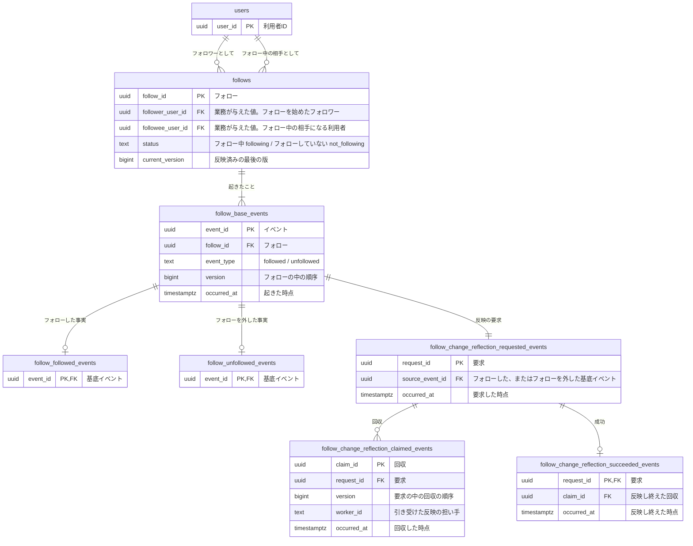

# フォローのコマンドデータモデル

サービスを運営する側が、利用者から「フォローした覚えがない」「外したはずの相手のポストが見える」と問われたときに、誰がいつ誰をフォローし、いつ外したかを起きた順に示せるように、二人の間のフォローに起きたことを積む。

フォローの変化をホームタイムラインへ反映する処理は、フォローと同期で行うと、反映先の遅れや失敗にフォローの成立まで巻き込まれる。そこで、フォローするとフォローを外すのと同じ一回の変更で反映の要求だけを積み、別の担い手が後で回収して反映する形（Outbox）にした。要件は反映できなかった要求を破棄しないと決めているので、反映し終わるまで要求を残し、要求、回収、成功を追加のみで積む。

## 二人の間のフォローを一つのリソースにし、起きたことを積む

| 系列 | 性質 | 論理テーブル | 保存表現 | 根拠 |
|---|---|---|---|---|
| リソース系 | 業務 | `follows` | 現在状態 | 業務知識「フォロー」 |
| イベント系 | 業務 | `follow_base_events` | イベント列 | 業務知識「誰がいつ誰をフォローし、いつ外したかを、起きた順に後から説明できる」 |
| イベント系 | 業務 | `follow_followed_events` | イベント列 | 業務イベント「フォローした」 |
| イベント系 | 業務 | `follow_unfollowed_events` | イベント列 | 業務イベント「フォローを外した」 |
| イベント系 | 技術 | `follow_change_reflection_requested_events` | イベント列 | 非機能要件「整合性と鮮度」フォロー変更のホームタイムラインへの非同期反映と、未完了の要求を破棄しないこと |
| イベント系 | 技術 | `follow_change_reflection_claimed_events` | イベント列 | 非機能要件「整合性と鮮度」フォロー変更のホームタイムラインへの非同期反映と、未完了の要求を破棄しないこと |
| イベント系 | 技術 | `follow_change_reflection_succeeded_events` | イベント列 | 非機能要件「整合性と鮮度」フォロー変更のホームタイムラインへの非同期反映と、未完了の要求を破棄しないこと |

フォローはイベント列を選んだ。業務イベントが「フォローした」と「フォローを外した」の二つあり、同じ二人の間で何度でも繰り返されるうえ、業務知識が、誰がいつ誰をフォローし、いつ外したかを起きた順に後から説明できることを求めているからである。いまの状態だけを持つと、外してまたフォローした経緯が上書きで消える。`follows`の`status`と`current_version`はイベントから導けるが、楽観ロックと、フォローできるかの判断での読み取りのために妥協として持つ。

リソースは、フォロワーと相手の二人の組み合わせ一つにした。業務知識は、一人のフォロワーが同じ相手をフォロー中なのは一つのフォローだけで、外した後にまたフォローしても同じ二人のフォローがフォロー中に戻る、と決めている。同じ組み合わせで有効なものは一つという決まりなので、フォローするとフォローを外すは、同じリソースの版を進める業務イベントになる。こうすると、二重にフォローしないことも、同じフォローを二度外さないことも、一つの行と版で判定できる。一人のフォロー中は5,000人まで、という決まりだけは、そのフォロワーの複数の行にまたがるので、競合する行の組としてBDD-006で示す。

フォロー中の人数は、そのフォロワーの`follows`のうち`status`が`following`の行を数えて得る情報である。そのためテーブルにも列にもしない。

フォローの変化の反映には、追い続ける対象が無い。要求そのものが最初の出来事なので、基底イベントを置かず、出来事ごとの表だけにした。反映の要求には、受け付けた時点で決めて後から導けない技術上の判断の値が無いので、起因の基底イベントを指す列だけを持つ。

作成、更新、削除の扱いは次のとおりである。作成は、二人の間で初めてフォローしたときに`follows`の行が生まれることで、BDD-001が示す。更新は、フォローを外す、またフォローする、のたびに`follows`の状態と版を進め、イベントを足すことで、BDD-003とBDD-004が示す。削除は無い。フォローを外すのは削除ではなく「フォローを外した」という事実を足すことで、要件は成立した業務イベントを期間にかかわらず削除しないと決め、フォローの現在状態を消す条件も初期リリースの対象外にしている。

## ほかの資料が持つテーブル

フォローする相手が登録済みの利用者かを判断するために、アカウントの業務が定義する利用者を読む。

| 参照するテーブル | 読む列 | 持ち主の資料 |
|---|---|---|
| `users` | `user_id` | [アカウントのコマンドデータモデル](../アカウント/command-data-model.md) |

## コマンドデータモデル図



## テーブル定義

### `follows`（フォロー）

一行が、一人のフォロワーから一人の相手へのフォロー一つを表し、そのフォローのいまの状態も持つ。二人の間で初めてフォローしたときに生まれ、その後は外しても、またフォローしても同じ行の状態と版が進む。フォロワーと相手は、フォローが生まれたときに業務が与えた値で、後から変わらない。変わると、同じフォローに起きたことの説明が別の二人の話になるからである。

#### 業務制約: 同じフォロワーと相手のフォローは一つ

同じ`follower_user_id`と`followee_user_id`の組の`follows`の行は一つしか無い（BDD-005）。

#### 業務制約: 自分へのフォローは無い

`follower_user_id`と`followee_user_id`は同じ値にならない（業務知識 BDD-004）。

#### 業務制約: 一人のフォロー中は5,000まで

`status`が`following`の`follows`の行は、同じ`follower_user_id`について5,000を超えない（BDD-006）。

#### 業務制約: 現在の版は最後のイベントの版

`current_version`は、そのフォローの`follow_base_events`の最大の`version`と等しく、`status`は、その`version`の行の`event_type`が`followed`なら`following`、`unfollowed`なら`not_following`である（BDD-003、BDD-004、BDD-007）。

### `follow_base_events`（フォローに起きたこと）

フォローに起きた業務イベントのうち、どの種類にも共通する事実を一行ずつ積む。フォローした時点とフォローを外した時点は、それぞれの行の`occurred_at`で表す。

#### 業務制約: 同じフォローの同じ版の出来事は一つ

`follow_id`と`version`の組は一意である（BDD-007）。

### `follow_followed_events`（フォローした）

フォローしたことに固有の事実は無い。フォロワーと相手は生まれたときに決まる値なので`follows`に置いた。出来事の種類ごとに表を一つ置く形にそろえる。

### `follow_unfollowed_events`（フォローを外した）

フォローを外したことに固有の事実は無い。

### `follow_change_reflection_requested_events`（フォローの変化の反映を頼んだ）

フォローした、またはフォローを外したことをホームタイムラインへ反映する要求を、業務イベント一件につき一行積む。業務イベントと同じ一回の変更で記録するので、フォローが成立したのに要求だけが無い、という状態は起きない。反映する利用者と相手は列に写さず、起因の基底イベントからフォローを辿って読む。フォローしたか外したかも、基底イベントの`event_type`で分かる。

#### 業務制約: 業務イベント一件に要求は一つ

同じ`source_event_id`の要求は一つしか無い（BDD-001、BDD-004）。

### `follow_change_reflection_claimed_events`（フォローの変化の反映を引き受けた）

反映の担い手が要求を引き受けた事実を、回収のたびに一行積む。誰が引き受けたかを残すので、止まった要求の原因を担い手ごとに調べられる。引き受けた担い手が止まっても要求が残り続けないように、引き受けには期限（リース）を置く。最新の回収の`occurred_at`から5分を過ぎても成功が無ければ、要求は再び回収できる。5分は、非機能要件が「5分間進捗が無いものを調停対象」としたことから仮に置いた値である。回収の回数に上限は置かない。要件は未完了の要求を古さや試行回数で破棄しないと決めているので、反映し終えるまで要求を残す。

#### 業務制約: 同じ要求の同じ版の回収は一つ

`request_id`と`version`の組は一意である（BDD-011）。

### `follow_change_reflection_succeeded_events`（フォローの変化を反映し終えた）

反映し終えた要求ごとに一行だけ積む。成功のある要求は、以後回収しない。

## 並行実行で必要な保証

同時に進むと結果が変わる組み合わせは四つあり、どれもBDDで行を示した。

同じ二人の間で初めてのフォローが同時に二つ進むと、先に記録された一つだけが成立する（BDD-005）。競合するのは、同じ`follower_user_id`と`followee_user_id`の組の`follows`の行である。

フォロー中が4,999人のフォロワーが二人を同時にフォローすると、先に記録された一人だけが成立する（BDD-006）。競合するのは一つの行ではなく、そのフォロワーの`status`が`following`の`follows`の行の集まりである。

同じフォローを同時に二回外すと、先に記録した方だけが成立する。後の方は、読んだ`current_version`がもう変わっているので成立しない（BDD-007）。競合するのは、そのフォローの`follows`の行と、同じ`version`の`follow_base_events`の行である。

反映の要求では、二つの担い手が同じ要求を同時に回収しうる。同じ`version`の回収は一つしか成立しない（BDD-011）。

## 業務知識のBDDとの対応

| 業務知識のBDD | この資料のBDD |
|---|---|
| BDD-001 | BDD-001 |
| BDD-002 | 対象外 |
| BDD-003 | 対象外 |
| BDD-004 | 対象外 |
| BDD-005 | BDD-002 |
| BDD-006 | BDD-005 |
| BDD-007 | 対象外 |
| BDD-008 | BDD-003 |
| BDD-009 | BDD-004 |
| BDD-010 | 対象外 |
| BDD-011 | 対象外 |
| BDD-012 | 対象外 |
| BDD-013 | 対象外 |
| BDD-014 | BDD-005 |
| BDD-015 | BDD-006 |
| BDD-016 | BDD-007 |
| BDD-017 | クエリデータモデル |

対象外にしたBDDは、すでにあるBDDと同じ行の変化になるか、記録に届かないかのどちらかである。4,999人目から5,000人目をフォローする場面（業務知識 BDD-002）と、上限に達した後に一人外して別の相手をフォローする場面（BDD-013）は、この資料のBDD-001と同じく、フォローと基底イベントと詳細イベントと反映の要求を一行ずつ足す。5,000人をフォロー中の利用者が順にもう一人をフォローする場面（BDD-003）は、フォローの行の集まりで拒まれて何も増えず、その形はBDD-006が示す。フォローしていない相手のフォローを外す二つの場面（BDD-010、BDD-011）は、`follows`の行が無いか`not_following`であることで拒まれて何も増えず、その形はBDD-007が示す。自分をフォローする場面（BDD-004）は、フォロワーと相手が同じだと分かった時点で、行を読む前に拒まれる。他人としてフォローする場面とフォローを外す場面（BDD-007、BDD-012）は、本人の確認で拒まれて記録に届かない。

## 未決

回収のリースを5分と仮に置いた。反映先の応答時間と、調停が進捗の無い要求を拾う間隔が負荷試験で分かれば確定する。確かめる相手は、要件を決めた利用者と物理設計の担当である。

フォローの変化の反映を諦めてよいかは、要件が「破棄しない」と決めているので、諦めた事実の表は置いていない。要件が変わり、諦めた後に誰が何をするかも決まったら足す。

## BDD

### [BDD-001] 初めて相手をフォローすると、フォローと、フォローした事実と、反映の要求が一緒に生まれる

```gherkin
Given: 利用者 U-0001 と利用者 U-0002 はどちらも登録済みの利用者である
  And: 利用者 U-0001 から利用者 U-0002 へのフォローは無く、利用者 U-0001 のフォロー中は0人である
When: 利用者 U-0001 が2026年10月1日 10:00に利用者 U-0002 をフォローする
Then: フォロー F-001 がフォロー中で生まれ、版は1である
  And: フォローした事実と、ホームタイムラインへ反映する要求が同じ変更で積まれる
```

#### データの状態

**Before**

**`users`**

| user_id |
|---|
| U-0001 |
| U-0002 |

**`follows`**

| follow_id | follower_user_id | followee_user_id | status | current_version |
|---|---|---|---|---|
| （行なし） | | | | |

**`follow_base_events`**

| event_id | follow_id | event_type | version | occurred_at |
|---|---|---|---|---|
| （行なし） | | | | |

**`follow_followed_events`**

| event_id |
|---|
| （行なし） |

**`follow_change_reflection_requested_events`**

| request_id | source_event_id | occurred_at |
|---|---|---|
| （行なし） | | |

**After**

**`users`**

| user_id |
|---|
| U-0001 |
| U-0002 |

**`follows`**

| follow_id | follower_user_id | followee_user_id | status | current_version |
|---|---|---|---|---|
| **F-001** | **U-0001** | **U-0002** | **following** | **1** |

**`follow_base_events`**

| event_id | follow_id | event_type | version | occurred_at |
|---|---|---|---|---|
| **E-001** | **F-001** | **followed** | **1** | **2026年10月1日 10:00** |

**`follow_followed_events`**

| event_id |
|---|
| **E-001** |

**`follow_change_reflection_requested_events`**

| request_id | source_event_id | occurred_at |
|---|---|---|
| **R-001** | **E-001** | **2026年10月1日 10:00** |

### [BDD-002] 登録されていない利用者IDの相手はフォローできず、何も増えない

```gherkin
Given: 利用者 U-0001 は登録済みの利用者で、フォロー中は0人である
  And: 利用者ID U-9999 の利用者は登録されていない
When: 利用者 U-0001 が2026年10月1日 10:00に利用者ID U-9999 の相手をフォローする
Then: フォローは記録されない
  NOTE: Rule: 登録されていない利用者をフォローする
    Reason: 登録済みの利用者でない相手には読むポストが無い
```

#### データの状態

**Before**

**`users`**

| user_id |
|---|
| U-0001 |

**`follows`**

| follow_id | follower_user_id | followee_user_id | status | current_version |
|---|---|---|---|---|
| （行なし） | | | | |

**`follow_base_events`**

| event_id | follow_id | event_type | version | occurred_at |
|---|---|---|---|---|
| （行なし） | | | | |

**After**

**`users`**

| user_id |
|---|
| U-0001 |

**`follows`**

| follow_id | follower_user_id | followee_user_id | status | current_version |
|---|---|---|---|---|
| （行なし） | | | | |

**`follow_base_events`**

| event_id | follow_id | event_type | version | occurred_at |
|---|---|---|---|---|
| （行なし） | | | | |

### [BDD-003] フォローを外した相手を再びフォローすると、同じフォローがフォロー中に戻り版が進む

```gherkin
Given: フォロー F-001 は、利用者 U-0001 が2026年10月1日 10:00に利用者 U-0002 をフォローし、2026年10月3日 10:00に外したもので、フォローしていない、版2である
When: 利用者 U-0001 が2026年10月5日 10:00に利用者 U-0002 をフォローする
Then: フォロー F-001 はフォロー中に戻り、版は3になる
  And: 新しいフォローした事実と、反映の要求が同じ変更で積まれ、フォローの行は増えない
```

#### データの状態

**Before**

**`follows`**

| follow_id | follower_user_id | followee_user_id | status | current_version |
|---|---|---|---|---|
| F-001 | U-0001 | U-0002 | not_following | 2 |

**`follow_base_events`**

| event_id | follow_id | event_type | version | occurred_at |
|---|---|---|---|---|
| E-001 | F-001 | followed | 1 | 2026年10月1日 10:00 |
| E-002 | F-001 | unfollowed | 2 | 2026年10月3日 10:00 |

**`follow_followed_events`**

| event_id |
|---|
| E-001 |

**`follow_change_reflection_requested_events`**

| request_id | source_event_id | occurred_at |
|---|---|---|
| R-001 | E-001 | 2026年10月1日 10:00 |
| R-002 | E-002 | 2026年10月3日 10:00 |

**After**

**`follows`**

| follow_id | follower_user_id | followee_user_id | status | current_version |
|---|---|---|---|---|
| F-001 | U-0001 | U-0002 | **following** | **3** |

**`follow_base_events`**

| event_id | follow_id | event_type | version | occurred_at |
|---|---|---|---|---|
| E-001 | F-001 | followed | 1 | 2026年10月1日 10:00 |
| E-002 | F-001 | unfollowed | 2 | 2026年10月3日 10:00 |
| **E-003** | **F-001** | **followed** | **3** | **2026年10月5日 10:00** |

**`follow_followed_events`**

| event_id |
|---|
| E-001 |
| **E-003** |

**`follow_change_reflection_requested_events`**

| request_id | source_event_id | occurred_at |
|---|---|---|
| R-001 | E-001 | 2026年10月1日 10:00 |
| R-002 | E-002 | 2026年10月3日 10:00 |
| **R-003** | **E-003** | **2026年10月5日 10:00** |

### [BDD-004] フォロー中の相手のフォローを外すと、フォローしていないになり、外した事実と反映の要求が積まれる

```gherkin
Given: フォロー F-001 は、利用者 U-0001 が2026年10月1日 10:00に利用者 U-0002 をフォローしたもので、フォロー中、版1である
When: 利用者 U-0001 が2026年10月3日 10:00に利用者 U-0002 のフォローを外す
Then: フォロー F-001 はフォローしていないになり、版は2になる
  And: フォローを外した事実と、反映の要求が同じ変更で積まれる
```

#### データの状態

**Before**

**`follows`**

| follow_id | follower_user_id | followee_user_id | status | current_version |
|---|---|---|---|---|
| F-001 | U-0001 | U-0002 | following | 1 |

**`follow_base_events`**

| event_id | follow_id | event_type | version | occurred_at |
|---|---|---|---|---|
| E-001 | F-001 | followed | 1 | 2026年10月1日 10:00 |

**`follow_unfollowed_events`**

| event_id |
|---|
| （行なし） |

**`follow_change_reflection_requested_events`**

| request_id | source_event_id | occurred_at |
|---|---|---|
| R-001 | E-001 | 2026年10月1日 10:00 |

**After**

**`follows`**

| follow_id | follower_user_id | followee_user_id | status | current_version |
|---|---|---|---|---|
| F-001 | U-0001 | U-0002 | **not_following** | **2** |

**`follow_base_events`**

| event_id | follow_id | event_type | version | occurred_at |
|---|---|---|---|---|
| E-001 | F-001 | followed | 1 | 2026年10月1日 10:00 |
| **E-002** | **F-001** | **unfollowed** | **2** | **2026年10月3日 10:00** |

**`follow_unfollowed_events`**

| event_id |
|---|
| **E-002** |

**`follow_change_reflection_requested_events`**

| request_id | source_event_id | occurred_at |
|---|---|---|
| R-001 | E-001 | 2026年10月1日 10:00 |
| **R-002** | **E-002** | **2026年10月3日 10:00** |

### [BDD-005] 同じ相手への初めてのフォローが先に記録されていると、同時に進んだもう一つのフォローは何も増やさない

```gherkin
Given: 利用者 U-0001 から利用者 U-0002 へのフォローは無かった
  And: 同時に出したフォローのうち一つが、フォロー F-001 として2026年10月1日 10:00に先に記録された
When: フォローが無いと読んで判断した、もう一つの利用者 U-0001 から利用者 U-0002 へのフォローを記録する
Then: もう一つのフォローは記録されず、フォローした事実も反映の要求も増えない
  NOTE: Rule: フォロー中の相手をフォローする
    Reason: 一人のフォロワーが同じ相手をフォロー中なのは一つのフォローだけである
```

#### データの状態

**Before**

**`follows`**

| follow_id | follower_user_id | followee_user_id | status | current_version |
|---|---|---|---|---|
| F-001 | U-0001 | U-0002 | following | 1 |

**`follow_base_events`**

| event_id | follow_id | event_type | version | occurred_at |
|---|---|---|---|---|
| E-001 | F-001 | followed | 1 | 2026年10月1日 10:00 |

**`follow_change_reflection_requested_events`**

| request_id | source_event_id | occurred_at |
|---|---|---|
| R-001 | E-001 | 2026年10月1日 10:00 |

**After**

**`follows`**

| follow_id | follower_user_id | followee_user_id | status | current_version |
|---|---|---|---|---|
| F-001 | U-0001 | U-0002 | following | 1 |

**`follow_base_events`**

| event_id | follow_id | event_type | version | occurred_at |
|---|---|---|---|---|
| E-001 | F-001 | followed | 1 | 2026年10月1日 10:00 |

**`follow_change_reflection_requested_events`**

| request_id | source_event_id | occurred_at |
|---|---|---|
| R-001 | E-001 | 2026年10月1日 10:00 |

### [BDD-006] 5,000人目のフォローが先に記録されたフォロワーの、同時に進んだ5,001人目のフォローは記録されない

```gherkin
Given: 利用者 U-0001 は利用者 U-1001 から U-5999 までの4,999人をフォロー中だった
  And: 同時にフォローした利用者 U-7001 へのフォロー F-5000 が、2026年10月1日 10:00に先に記録された
When: フォロー中を4,999人と数えて判断した、利用者 U-0001 から利用者 U-7002 へのフォローを記録する
Then: 利用者 U-7002 へのフォローは記録されない
  NOTE: Rule: フォロー上限に達している利用者がフォローする
    Reason: 一人のフォロワーのフォロー中の人数は5,000人を超えない
```

#### データの状態

**Before**

**`follows`**

| follow_id | follower_user_id | followee_user_id | status | current_version |
|---|---|---|---|---|
| F-0001 | U-0001 | U-1001 | following | 1 |
| F-0002〜F-4998 | U-0001 | U-1002〜U-5998 | following | 1 |
| F-4999 | U-0001 | U-5999 | following | 1 |
| F-5000 | U-0001 | U-7001 | following | 1 |

**After**

**`follows`**

| follow_id | follower_user_id | followee_user_id | status | current_version |
|---|---|---|---|---|
| F-0001 | U-0001 | U-1001 | following | 1 |
| F-0002〜F-4998 | U-0001 | U-1002〜U-5998 | following | 1 |
| F-4999 | U-0001 | U-5999 | following | 1 |
| F-5000 | U-0001 | U-7001 | following | 1 |

### [BDD-007] フォローを外したことが先に記録されたフォローは、古い版でもう一度外しても変わらない

```gherkin
Given: 利用者 U-0001 は、フォロー F-001 を版1のフォロー中として読んだ
  And: その後、同時に出したもう一つの「フォローを外す」が2026年10月3日 10:00に先に記録され、版は2になった
When: 読んだ版1のフォロー F-001 を、2026年10月3日 10:00に外したことを記録する
Then: 二つ目のフォローを外した事実は記録されず、フォロー F-001 はフォローしていない、版2のまま変わらない
  NOTE: Rule: フォローしていない相手のフォローを外す
    Reason: フォローしていない相手には外すフォローが無い
```

#### データの状態

**Before**

**`follows`**

| follow_id | follower_user_id | followee_user_id | status | current_version |
|---|---|---|---|---|
| F-001 | U-0001 | U-0002 | not_following | 2 |

**`follow_base_events`**

| event_id | follow_id | event_type | version | occurred_at |
|---|---|---|---|---|
| E-001 | F-001 | followed | 1 | 2026年10月1日 10:00 |
| E-002 | F-001 | unfollowed | 2 | 2026年10月3日 10:00 |

**After**

**`follows`**

| follow_id | follower_user_id | followee_user_id | status | current_version |
|---|---|---|---|---|
| F-001 | U-0001 | U-0002 | not_following | 2 |

**`follow_base_events`**

| event_id | follow_id | event_type | version | occurred_at |
|---|---|---|---|---|
| E-001 | F-001 | followed | 1 | 2026年10月1日 10:00 |
| E-002 | F-001 | unfollowed | 2 | 2026年10月3日 10:00 |

### [BDD-008] 反映の担い手が要求を回収する

```gherkin
Given: 要求 R-001 には回収も成功も無い
When: 担い手 W-1 が2026年10月1日 10:01に要求 R-001 を回収する
Then: 版1の回収が積まれ、要求 R-001 は5分の間ほかの担い手に回収されない
```

#### データの状態

**Before**

**`follow_change_reflection_claimed_events`**

| claim_id | request_id | version | worker_id | occurred_at |
|---|---|---|---|---|
| （行なし） | | | | |

**`follow_change_reflection_succeeded_events`**

| request_id | claim_id | occurred_at |
|---|---|---|
| （行なし） | | |

**After**

**`follow_change_reflection_claimed_events`**

| claim_id | request_id | version | worker_id | occurred_at |
|---|---|---|---|---|
| **C-001** | **R-001** | **1** | **W-1** | **2026年10月1日 10:01** |

**`follow_change_reflection_succeeded_events`**

| request_id | claim_id | occurred_at |
|---|---|---|
| （行なし） | | |

### [BDD-009] 回収した担い手が反映し終えると成功が積まれる

```gherkin
Given: 要求 R-001 は担い手 W-1 が2026年10月1日 10:01に版1で回収しており、成功は無い
When: 担い手 W-1 が2026年10月1日 10:02に要求 R-001 の反映を終える
Then: 成功が一件積まれ、要求 R-001 は以後回収されない
```

#### データの状態

**Before**

**`follow_change_reflection_claimed_events`**

| claim_id | request_id | version | worker_id | occurred_at |
|---|---|---|---|---|
| C-001 | R-001 | 1 | W-1 | 2026年10月1日 10:01 |

**`follow_change_reflection_succeeded_events`**

| request_id | claim_id | occurred_at |
|---|---|---|
| （行なし） | | |

**After**

**`follow_change_reflection_claimed_events`**

| claim_id | request_id | version | worker_id | occurred_at |
|---|---|---|---|---|
| C-001 | R-001 | 1 | W-1 | 2026年10月1日 10:01 |

**`follow_change_reflection_succeeded_events`**

| request_id | claim_id | occurred_at |
|---|---|---|
| **R-001** | **C-001** | **2026年10月1日 10:02** |

### [BDD-010] 二度リースが切れた要求も、別の担い手が再び回収する

```gherkin
Given: 要求 R-001 は、担い手 W-1 が2026年10月1日 10:01に版1で、担い手 W-2 が10:07に版2で回収したが、どちらも成功を積まずに止まった
When: 担い手 W-3 が2026年10月1日 10:13に要求 R-001 を回収する
Then: 版3の回収が積まれる
  And: 要求 R-001 は、反映し終えるまで回収の候補に残る
```

#### データの状態

**Before**

**`follow_change_reflection_claimed_events`**

| claim_id | request_id | version | worker_id | occurred_at |
|---|---|---|---|---|
| C-001 | R-001 | 1 | W-1 | 2026年10月1日 10:01 |
| C-002 | R-001 | 2 | W-2 | 2026年10月1日 10:07 |

**`follow_change_reflection_succeeded_events`**

| request_id | claim_id | occurred_at |
|---|---|---|
| （行なし） | | |

**After**

**`follow_change_reflection_claimed_events`**

| claim_id | request_id | version | worker_id | occurred_at |
|---|---|---|---|---|
| C-001 | R-001 | 1 | W-1 | 2026年10月1日 10:01 |
| C-002 | R-001 | 2 | W-2 | 2026年10月1日 10:07 |
| **C-003** | **R-001** | **3** | **W-3** | **2026年10月1日 10:13** |

**`follow_change_reflection_succeeded_events`**

| request_id | claim_id | occurred_at |
|---|---|---|
| （行なし） | | |

### [BDD-011] 二つの担い手が同じ要求を回収すると、先に記録した一方だけが積まれる

```gherkin
Given: 要求 R-002 には回収が無かった
  And: 担い手 W-1 の版1の回収が、2026年10月3日 10:01に先に記録された
When: 同じ要求を版1として回収しようとした担い手 W-2 の回収を記録する
Then: 担い手 W-2 の回収は積まれず、担い手 W-2 は要求 R-002 を反映しない
```

#### データの状態

**Before**

**`follow_change_reflection_claimed_events`**

| claim_id | request_id | version | worker_id | occurred_at |
|---|---|---|---|---|
| C-011 | R-002 | 1 | W-1 | 2026年10月3日 10:01 |

**After**

**`follow_change_reflection_claimed_events`**

| claim_id | request_id | version | worker_id | occurred_at |
|---|---|---|---|---|
| C-011 | R-002 | 1 | W-1 | 2026年10月3日 10:01 |
