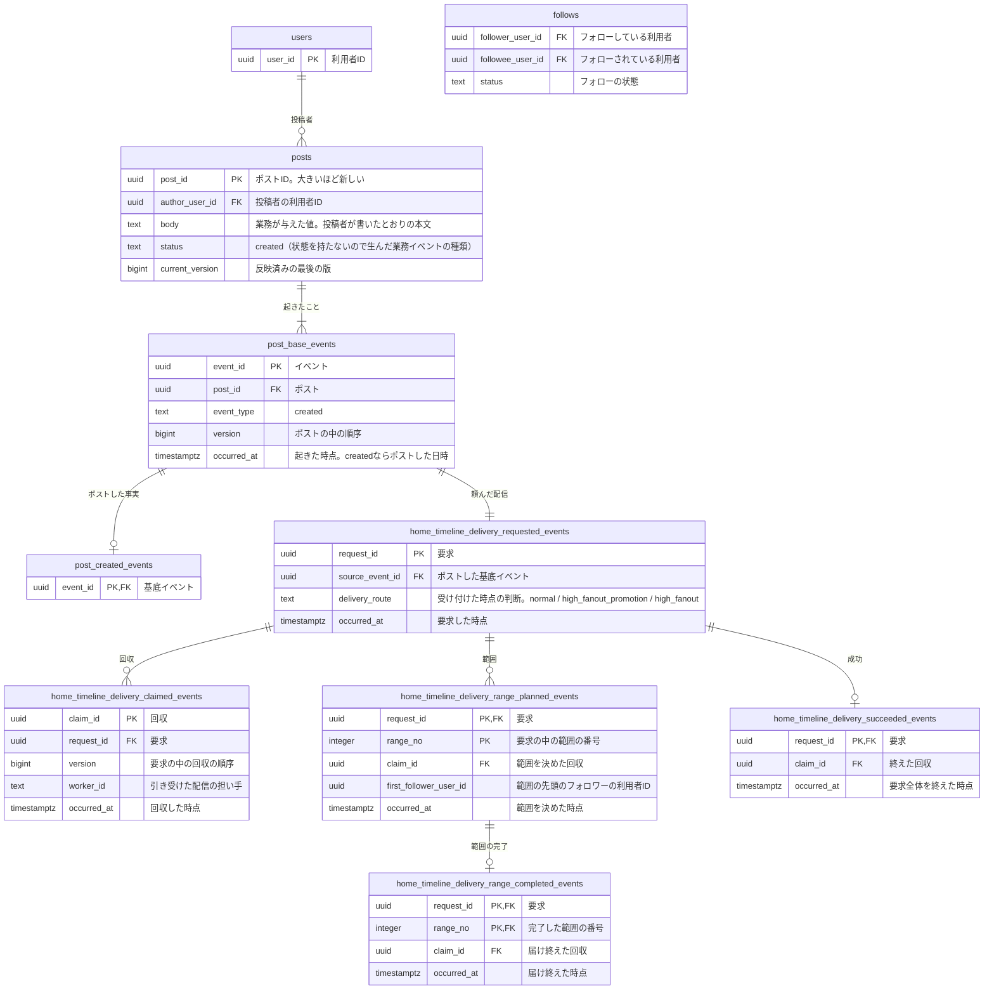

# ポストのコマンドデータモデル

サービスの運営者が、利用者から「このポストはいつ、どの本文でしたか」「どちらが先ですか」と問われたときに、その利用者のポストを起きた順に示して答えられるように、ポストに起きたことを積む。ポストは生まれた後に変わらないので、残す事実は一件ごとの「ポストした」だけである。

ポストをフォロワーと投稿者本人のホームタイムラインへ届ける配信は、ポストと同じ流れで行うと、フォロワーの多い投稿者の一件がポストの受け付けそのものを止めてしまう。要件は、配信が止まってもポストは成り立ち、止まった配信は復旧後に再開し、未完了の配信を破棄しないことを求めている（バックエンド要件「操作の成功境界」、非機能要件「信頼性」）。そこで、ポストするのと同じ一回の変更で配信の要求だけを積み、配信の担い手が後で回収して届ける形（Outbox）にした。頼んだ配信が終わるまで要求を残し、要求、回収、範囲の決定と完了、成功を追加のみで積む。

## ポストを一件ごとのリソースにし、ポストしたことと配信の要求を積む

| 系列 | 性質 | 論理テーブル | 保存表現 | 根拠 |
|---|---|---|---|---|
| リソース系 | 業務 | `posts` | 現在状態 | 業務知識「ポスト」 |
| イベント系 | 業務 | `post_base_events` | イベント列 | 業務知識「後から説明できる」 |
| イベント系 | 業務 | `post_created_events` | イベント列 | 業務イベント「ポストした」 |
| イベント系 | 技術 | `home_timeline_delivery_requested_events` | イベント列 | 非機能要件「信頼性」「整合性と鮮度」 |
| イベント系 | 技術 | `home_timeline_delivery_claimed_events` | イベント列 | 非機能要件「信頼性」「整合性と鮮度」 |
| イベント系 | 技術 | `home_timeline_delivery_range_planned_events` | イベント列 | 利用規模と負荷モデル「配信先数の偏りを残す」 |
| イベント系 | 技術 | `home_timeline_delivery_range_completed_events` | イベント列 | 利用規模と負荷モデル「配信先数の偏りを残す」 |
| イベント系 | 技術 | `home_timeline_delivery_succeeded_events` | イベント列 | 非機能要件「整合性と鮮度」 |

ポストはイベント列を選んだ。業務知識が、誰が、いつ、どの本文をポストし、それがどの順だったかを後から説明できることを求めているからである。業務イベントは今のところ「ポストした」一つだけだが、後から説明する対象がこの出来事そのものなので、出来事を積む形にした。`posts` の `status` と `current_version` はイベントから導けるが、型の妥協として持つ。業務知識はポストが状態を持たないと書いているので、`status` は生んだ業務イベントの種類と同じ `created` にし、`current_version` は1にする。業務知識に無い状態名は作らない。

リソースは一件のポストにした。ポストするたびに、その回だけの本文と投稿者が決まり、本文と投稿者が変わらないことは一つのポストの行と版で判定できるからである。同じ本文のポストが既にあるかは判断に使わないので、複数の行にまたがる決まりは無い。

ポストした日時は、`post_base_events` の `created` の行の `occurred_at` で表し、`posts` に写さない。新しい順は `post_id` の大小で決まるので、並びのための列も持たない。

配信には追い続ける対象が無い。要求そのものが最初の出来事なので、基底イベントを置かず、出来事ごとの表だけにした。受け付けた時点のフォロワー数で選んだ配信の経路は、その時点の件数で決まり、後からフォロワーが増減すると同じ値を導けない。そのため、業務のテーブルではなく配信の要求の列 `delivery_route` に置いた。どの投稿者が高ファンアウトの経路へ移ったかの一覧は、この列から導ける情報なので表にしない。

## ほかの資料が持つテーブル

投稿者が登録を終えた利用者かどうかと、受け付けた時点のフォロワー数を読む。`follows` は持ち主の資料がまだ置かれていないので、テーブル名と列名を予定の名前で書いた。

| 参照するテーブル | 読む列 | 持ち主の資料 |
|---|---|---|
| `users` | `user_id` | [アカウントのコマンドデータモデル](../アカウント/command-data-model.md) |
| `follows` | `follower_user_id`、`followee_user_id`、`status` | [フォローのコマンドデータモデル](../フォロー/command-data-model.md) |

## コマンドデータモデル図



## テーブル定義

### `posts`（ポスト）

一行が一件のポストを表す。本文と投稿者は、ポストしたときに業務が与えた値で、その後変わらない。本文は、前後の空白も含めて、投稿者が書いたとおりに持つ。`post_id` はポストしたときに決まり、新しい順はこの値の大小で決まる。

#### 業務制約: 本文は1文字以上280文字以下で空白でない文字を含む

`body` の Unicode のコードポイントの数は1以上280以下で、Unicode で空白とされる文字以外の文字を一つ以上含む（業務知識 BDD-002 から BDD-007）。

#### 業務制約: ポストは一つの業務イベントだけを持つ

`status` は `created`、`current_version` は1で、そのポストの `post_base_events` は `version` が1の `created` の行一つだけである（BDD-001）。ポストを変える行いが業務知識に無いからである。

### `post_base_events`（ポストに起きたこと）

ポストに起きた業務イベントのうち、どの種類にも共通する事実を一行ずつ積む。`post_id` と `version` の組は一意である。今は `created` だけが起きる。

### `post_created_events`（ポストした）

ポストしたことに固有の事実は無い。本文と投稿者は生まれたときに決まる値なので `posts` に置いた。出来事の種類ごとに表を一つ置く形にそろえる。

### `home_timeline_delivery_requested_events`（ホームタイムラインへの配信を頼んだ）

ポストしたことに対して、そのポストを投稿者本人とフォロワーのホームタイムラインへ届ける要求を、一件一行で積む。「ポストした」と同じ一回の変更で記録するので、ポストがあるのに配信の要求が無い状態は起きない。届ける相手は列に写さず、要求を処理するときに起因の基底イベントからポストと投稿者を辿って読む。

`delivery_route` は、受け付けた時点で選んだ配信の経路である。投稿者のこれまでの要求に `high_fanout_promotion` か `high_fanout` があれば `high_fanout`、無くて受け付けた時点のフォロワーが1万人以上なら `high_fanout_promotion`、1万人未満なら `normal` にする。`high_fanout_promotion` は、投稿者が初めて高ファンアウトの経路へ移る一回で、全フォロワーへ投稿者を「閲覧時に合成する投稿者」として加える配信を伴う。一度移った投稿者は戻らない。1万人は要件が安全側へ置いた設計値である。

#### 業務制約: 配信の要求は、ポストした出来事一つに一つ

`source_event_id` は一意で、`created` の基底イベントごとにちょうど一つの要求がある（BDD-001）。

### `home_timeline_delivery_claimed_events`（配信を引き受けた）

配信の担い手が要求を引き受けた事実を、回収のたびに一行積む。誰が引き受けたかを残すので、止まった要求の原因を担い手ごとに調べられる。引き受けには期限（リース）を置き、最新の回収の `occurred_at` から5分を過ぎても成功が無ければ、要求は再び回収できる。5分は仮に置いた値である。要件は未完了の要求を古さや試行回数を理由に破棄しないと決めているので、回収の回数に上限は置かず、諦めた事実の表も置かない。

#### 業務制約: 同じ要求の同じ版の回収は一つ

`request_id` と `version` の組は一意である（BDD-012）。

### `home_timeline_delivery_range_planned_events`（配信の範囲を決めた）

フォロワーへ届ける要求（`normal` と `high_fanout_promotion`）を、フォロワーの利用者IDの順に並べて区切った範囲を、一範囲一行で積む。範囲 n は、`first_follower_user_id` から、次の番号の範囲の `first_follower_user_id` の手前までで、最後の範囲は終わりまでである。範囲は要求ごとに一度だけ、一回の変更でまとめて決める。決めた範囲を残すのは、担い手が止まっても、どの範囲が残っているかを失わずに続けるためである。`high_fanout` の要求は投稿者のユーザータイムラインへの反映だけなので、範囲を決めない。どこで区切るかと、範囲の中をどの大きさで進めるかは方式なので、物理設計が決める。

#### 業務制約: 要求の範囲は一度だけ決める

一つの `request_id` の行は、同じ `occurred_at` と同じ `claim_id` で決めたものだけで、`range_no` は1から欠けずに続く（BDD-009、BDD-011）。

### `home_timeline_delivery_range_completed_events`（範囲へ届け終えた）

決めた範囲の一つへ届け終えた事実を、一範囲一行だけ積む。どの回収で届け終えたかを参照する。

#### 業務制約: 範囲の完了は範囲ごとに一つ

`request_id` と `range_no` の組は一意で、その組の `home_timeline_delivery_range_planned_events` がある（BDD-010）。

### `home_timeline_delivery_succeeded_events`（配信を終えた）

要求全体を届け終えた要求ごとに一行だけ積む。成功のある要求は、以後回収しない。

#### 業務制約: 範囲のある要求は、すべての範囲が完了した後にだけ成功する

範囲を決めた要求の成功の行は、その要求のすべての `range_no` に `home_timeline_delivery_range_completed_events` がある場合だけある（BDD-010、BDD-013）。

## 並行実行で必要な保証

同時に進むと結果が変わるのは、二つの配信の担い手が同じ要求を同時に回収する場面である。同じ `version` の回収は一つしか成立しないので、後から記録しようとした担い手は何も積まず、その要求を届けない（BDD-012）。競合するのは、その要求の同じ `version` の `home_timeline_delivery_claimed_events` の行である。

ポストすること自体は、業務知識の「同時に起きたとき」が「なし」としたとおり、ほかのポストと競合しない。

## 業務知識のBDDとの対応

| 業務知識のBDD | この資料のBDD |
|---|---|
| BDD-001 | BDD-001 |
| BDD-002 | 対象外 |
| BDD-003 | 対象外 |
| BDD-004 | 対象外 |
| BDD-005 | 対象外 |
| BDD-006 | 対象外 |
| BDD-007 | 対象外 |
| BDD-008 | BDD-002 |
| BDD-009 | BDD-003 |
| BDD-010 | 対象外 |
| BDD-011 | 対象外 |

1文字と280文字ちょうどの本文をポストする場面（業務知識 BDD-002 と BDD-003）は、この資料の BDD-001 と同じく、ポスト、基底イベント、詳細イベント、配信の要求を一行ずつ足すだけなので対象外にした。本文の長さや空白で拒む四つの場面（BDD-004 から BDD-007）は、保存する前の受け付けで拒まれ、何も増えない。ほかの利用者としてポストする場面と、利用者として登録していない人がポストする場面（BDD-010、BDD-011）は、誰が行っているかの確認で拒まれ、記録に届かない。

## 未決

回収のリースを5分と仮に置いた。要件の「5分間進捗が無いものを調停対象とする」に合わせた値で、配信の担い手の実測の処理時間が分かれば確定する。採らなかった案は、範囲一つの処理時間から決める長さである。確かめる相手は要件の回答責任者である。

配信の範囲を要求ごとに一度だけ決めることにしたのは仮説である。要件はバッチ完了、範囲完了、要求全体完了の記録を求めているが、範囲をいつ誰が決めるかは書いていない。範囲を決めた後にフォローした利用者は、決めた範囲のどこかに入るので、範囲の区切りで取りこぼしは起きない。採らなかった案は、範囲の完了のたびに次の範囲を決める形である。バッチの完了は範囲の中の継続位置の話として物理設計へ申し送った。

同じ投稿者の二件のポストが、フォロワー1万人以上で同時に受け付けられると、どちらも `high_fanout_promotion` を選びうる。届ける先が同じ投稿者の追加なので、二度行っても結果は同じになると推定しているが、要件はこの場面を書いていない。二件目を `high_fanout` にすべきかを要件の回答責任者に確かめる。

`follows` の持ち主の資料（フォローのコマンドデータモデル）がまだ置かれていないので、テーブル名、読む列、フォロー中を表す `status` の値 `following` を照合していない。置かれたら同じ入口で照合する。`users` の `user_id` は、アカウントのコマンドデータモデルと照合した。

## BDD

### [BDD-001] 利用者がポストすると、ポストとポストした事実と配信の要求が同じ変更で生まれる

```gherkin
Given: 利用者 U-0001 は登録を終えており、フォロワーは利用者 U-0002 と U-0003 の2人である
  And: 利用者 U-0001 には、これまでの配信の要求が無い
When: 利用者 U-0001 が2026年10月1日 10:00に本文「はじめてのポスト」をポストする
Then: ポスト P-0001 が生まれ、ポストした事実が版1で積まれる
  And: 受け付けた時点のフォロワーが1万人未満なので、経路 normal の配信の要求が同じ変更で積まれる
```

#### データの状態

**Before**

**`users`**

| user_id |
|---|
| U-0001 |
| U-0002 |
| U-0003 |

**`follows`**

| follower_user_id | followee_user_id | status |
|---|---|---|
| U-0002 | U-0001 | following |
| U-0003 | U-0001 | following |

**`posts`**

| post_id | author_user_id | body | status | current_version |
|---|---|---|---|---|
| （行なし） | | | | |

**`post_base_events`**

| event_id | post_id | event_type | version | occurred_at |
|---|---|---|---|---|
| （行なし） | | | | |

**`post_created_events`**

| event_id |
|---|
| （行なし） |

**`home_timeline_delivery_requested_events`**

| request_id | source_event_id | delivery_route | occurred_at |
|---|---|---|---|
| （行なし） | | | |

**After**

**`users`**

| user_id |
|---|
| U-0001 |
| U-0002 |
| U-0003 |

**`follows`**

| follower_user_id | followee_user_id | status |
|---|---|---|
| U-0002 | U-0001 | following |
| U-0003 | U-0001 | following |

**`posts`**

| post_id | author_user_id | body | status | current_version |
|---|---|---|---|---|
| **P-0001** | **U-0001** | **はじめてのポスト** | **created** | **1** |

**`post_base_events`**

| event_id | post_id | event_type | version | occurred_at |
|---|---|---|---|---|
| **E-0001** | **P-0001** | **created** | **1** | **2026年10月1日 10:00** |

**`post_created_events`**

| event_id |
|---|
| **E-0001** |

**`home_timeline_delivery_requested_events`**

| request_id | source_event_id | delivery_route | occurred_at |
|---|---|---|---|
| **R-0001** | **E-0001** | **normal** | **2026年10月1日 10:00** |

### [BDD-002] 前後に空白のある本文は、空白を含めたまま残る

```gherkin
Given: 利用者 U-0001 は登録を終えており、フォロワーはいない
  And: 利用者 U-0001 には、これまでのポストも配信の要求も無い
When: 利用者 U-0001 が2026年10月1日 10:00に、半角空白2文字、「こんにちは」、改行1文字の順に並んだ本文（8文字）をポストする
Then: ポスト P-0002 の本文は、前の半角空白2文字と後ろの改行1文字を含む8文字で残る
```

`body` の欄の `␣` は半角空白1文字、`⏎` は改行1文字を表す。

#### データの状態

**Before**

**`posts`**

| post_id | author_user_id | body | status | current_version |
|---|---|---|---|---|
| （行なし） | | | | |

**`post_base_events`**

| event_id | post_id | event_type | version | occurred_at |
|---|---|---|---|---|
| （行なし） | | | | |

**`post_created_events`**

| event_id |
|---|
| （行なし） |

**`home_timeline_delivery_requested_events`**

| request_id | source_event_id | delivery_route | occurred_at |
|---|---|---|---|
| （行なし） | | | |

**After**

**`posts`**

| post_id | author_user_id | body | status | current_version |
|---|---|---|---|---|
| **P-0002** | **U-0001** | **␣␣こんにちは⏎** | **created** | **1** |

**`post_base_events`**

| event_id | post_id | event_type | version | occurred_at |
|---|---|---|---|---|
| **E-0002** | **P-0002** | **created** | **1** | **2026年10月1日 10:00** |

**`post_created_events`**

| event_id |
|---|
| **E-0002** |

**`home_timeline_delivery_requested_events`**

| request_id | source_event_id | delivery_route | occurred_at |
|---|---|---|---|
| **R-0002** | **E-0002** | **normal** | **2026年10月1日 10:00** |

### [BDD-003] 同じ本文を二度ポストすると、別のポストの行が二つになる

```gherkin
Given: 利用者 U-0001 は2026年10月1日 10:00に本文「おはよう」をポストし、ポスト P-0001 と要求 R-0001 が記録されている
  And: 利用者 U-0001 のフォロワーは1万人未満である
When: 利用者 U-0001 が2026年10月1日 10:01に同じ本文「おはよう」をポストする
Then: ポスト P-0001 とは別のポスト P-0003 が生まれ、ポスト P-0001 の行は変わらない
```

#### データの状態

**Before**

**`posts`**

| post_id | author_user_id | body | status | current_version |
|---|---|---|---|---|
| P-0001 | U-0001 | おはよう | created | 1 |

**`post_base_events`**

| event_id | post_id | event_type | version | occurred_at |
|---|---|---|---|---|
| E-0001 | P-0001 | created | 1 | 2026年10月1日 10:00 |

**`post_created_events`**

| event_id |
|---|
| E-0001 |

**`home_timeline_delivery_requested_events`**

| request_id | source_event_id | delivery_route | occurred_at |
|---|---|---|---|
| R-0001 | E-0001 | normal | 2026年10月1日 10:00 |

**After**

**`posts`**

| post_id | author_user_id | body | status | current_version |
|---|---|---|---|---|
| P-0001 | U-0001 | おはよう | created | 1 |
| **P-0003** | **U-0001** | **おはよう** | **created** | **1** |

**`post_base_events`**

| event_id | post_id | event_type | version | occurred_at |
|---|---|---|---|---|
| E-0001 | P-0001 | created | 1 | 2026年10月1日 10:00 |
| **E-0003** | **P-0003** | **created** | **1** | **2026年10月1日 10:01** |

**`post_created_events`**

| event_id |
|---|
| E-0001 |
| **E-0003** |

**`home_timeline_delivery_requested_events`**

| request_id | source_event_id | delivery_route | occurred_at |
|---|---|---|---|
| R-0001 | E-0001 | normal | 2026年10月1日 10:00 |
| **R-0003** | **E-0003** | **normal** | **2026年10月1日 10:01** |

### [BDD-004] 受け付けた時点のフォロワーが9,999人なら、経路は normal になる

```gherkin
Given: 利用者 U-0100 のフォロワーは、利用者 U-1001 から U-10999 までの9,999人である
  And: 利用者 U-0100 には、これまでの配信の要求が無い
When: 利用者 U-0100 が2026年10月1日 12:00に本文「告知です」をポストする
Then: 経路 normal の配信の要求が積まれる
```

#### データの状態

**Before**

**`follows`**

| follower_user_id | followee_user_id | status |
|---|---|---|
| U-1001 | U-0100 | following |
| U-1002 〜 U-10998（9,997行） | U-0100 | following |
| U-10999 | U-0100 | following |

**`posts`**

| post_id | author_user_id | body | status | current_version |
|---|---|---|---|---|
| （行なし） | | | | |

**`post_base_events`**

| event_id | post_id | event_type | version | occurred_at |
|---|---|---|---|---|
| （行なし） | | | | |

**`post_created_events`**

| event_id |
|---|
| （行なし） |

**`home_timeline_delivery_requested_events`**

| request_id | source_event_id | delivery_route | occurred_at |
|---|---|---|---|
| （行なし） | | | |

**After**

**`follows`**

| follower_user_id | followee_user_id | status |
|---|---|---|
| U-1001 | U-0100 | following |
| U-1002 〜 U-10998（9,997行） | U-0100 | following |
| U-10999 | U-0100 | following |

**`posts`**

| post_id | author_user_id | body | status | current_version |
|---|---|---|---|---|
| **P-0100** | **U-0100** | **告知です** | **created** | **1** |

**`post_base_events`**

| event_id | post_id | event_type | version | occurred_at |
|---|---|---|---|---|
| **E-0100** | **P-0100** | **created** | **1** | **2026年10月1日 12:00** |

**`post_created_events`**

| event_id |
|---|
| **E-0100** |

**`home_timeline_delivery_requested_events`**

| request_id | source_event_id | delivery_route | occurred_at |
|---|---|---|---|
| **R-0100** | **E-0100** | **normal** | **2026年10月1日 12:00** |

### [BDD-005] 受け付けた時点のフォロワーが1万人ちょうどなら、初めて高ファンアウトの経路へ移る

```gherkin
Given: 利用者 U-0100 のフォロワーは、利用者 U-1001 から U-11000 までの10,000人である
  And: 利用者 U-0100 の配信の要求は、2026年10月1日 12:00のポスト P-0100 の経路 normal の要求 R-0100 だけである
When: 利用者 U-0100 が2026年10月2日 09:00に本文「続報です」をポストする
Then: 経路 high_fanout_promotion の配信の要求が積まれる
```

#### データの状態

**Before**

**`follows`**

| follower_user_id | followee_user_id | status |
|---|---|---|
| U-1001 | U-0100 | following |
| U-1002 〜 U-10999（9,998行） | U-0100 | following |
| U-11000 | U-0100 | following |

**`posts`**

| post_id | author_user_id | body | status | current_version |
|---|---|---|---|---|
| P-0100 | U-0100 | 告知です | created | 1 |

**`post_base_events`**

| event_id | post_id | event_type | version | occurred_at |
|---|---|---|---|---|
| E-0100 | P-0100 | created | 1 | 2026年10月1日 12:00 |

**`post_created_events`**

| event_id |
|---|
| E-0100 |

**`home_timeline_delivery_requested_events`**

| request_id | source_event_id | delivery_route | occurred_at |
|---|---|---|---|
| R-0100 | E-0100 | normal | 2026年10月1日 12:00 |

**After**

**`follows`**

| follower_user_id | followee_user_id | status |
|---|---|---|
| U-1001 | U-0100 | following |
| U-1002 〜 U-10999（9,998行） | U-0100 | following |
| U-11000 | U-0100 | following |

**`posts`**

| post_id | author_user_id | body | status | current_version |
|---|---|---|---|---|
| P-0100 | U-0100 | 告知です | created | 1 |
| **P-0101** | **U-0100** | **続報です** | **created** | **1** |

**`post_base_events`**

| event_id | post_id | event_type | version | occurred_at |
|---|---|---|---|---|
| E-0100 | P-0100 | created | 1 | 2026年10月1日 12:00 |
| **E-0101** | **P-0101** | **created** | **1** | **2026年10月2日 09:00** |

**`post_created_events`**

| event_id |
|---|
| E-0100 |
| **E-0101** |

**`home_timeline_delivery_requested_events`**

| request_id | source_event_id | delivery_route | occurred_at |
|---|---|---|---|
| R-0100 | E-0100 | normal | 2026年10月1日 12:00 |
| **R-0101** | **E-0101** | **high_fanout_promotion** | **2026年10月2日 09:00** |

### [BDD-006] 一度高ファンアウトの経路へ移った投稿者は、フォロワーが1万人を下回っても戻らない

```gherkin
Given: 利用者 U-0100 は2026年10月2日 09:00のポスト P-0101 で経路 high_fanout_promotion の要求 R-0101 を積んでいる
  And: その後フォローが外され、2026年10月3日 09:00の時点のフォロワーは U-1001 から U-9000 までの8,000人である
When: 利用者 U-0100 が2026年10月3日 09:00に本文「三報目です」をポストする
Then: 経路 high_fanout の配信の要求が積まれる
```

#### データの状態

**Before**

**`follows`**

| follower_user_id | followee_user_id | status |
|---|---|---|
| U-1001 | U-0100 | following |
| U-1002 〜 U-8999（7,998行） | U-0100 | following |
| U-9000 | U-0100 | following |

**`posts`**

| post_id | author_user_id | body | status | current_version |
|---|---|---|---|---|
| P-0101 | U-0100 | 続報です | created | 1 |

**`post_base_events`**

| event_id | post_id | event_type | version | occurred_at |
|---|---|---|---|---|
| E-0101 | P-0101 | created | 1 | 2026年10月2日 09:00 |

**`post_created_events`**

| event_id |
|---|
| E-0101 |

**`home_timeline_delivery_requested_events`**

| request_id | source_event_id | delivery_route | occurred_at |
|---|---|---|---|
| R-0101 | E-0101 | high_fanout_promotion | 2026年10月2日 09:00 |

**After**

**`follows`**

| follower_user_id | followee_user_id | status |
|---|---|---|
| U-1001 | U-0100 | following |
| U-1002 〜 U-8999（7,998行） | U-0100 | following |
| U-9000 | U-0100 | following |

**`posts`**

| post_id | author_user_id | body | status | current_version |
|---|---|---|---|---|
| P-0101 | U-0100 | 続報です | created | 1 |
| **P-0102** | **U-0100** | **三報目です** | **created** | **1** |

**`post_base_events`**

| event_id | post_id | event_type | version | occurred_at |
|---|---|---|---|---|
| E-0101 | P-0101 | created | 1 | 2026年10月2日 09:00 |
| **E-0102** | **P-0102** | **created** | **1** | **2026年10月3日 09:00** |

**`post_created_events`**

| event_id |
|---|
| E-0101 |
| **E-0102** |

**`home_timeline_delivery_requested_events`**

| request_id | source_event_id | delivery_route | occurred_at |
|---|---|---|---|
| R-0101 | E-0101 | high_fanout_promotion | 2026年10月2日 09:00 |
| **R-0102** | **E-0102** | **high_fanout** | **2026年10月3日 09:00** |

### [BDD-007] 配信の担い手が配信の要求を回収する

```gherkin
Given: 要求 R-0001 は経路 normal で、回収も成功も無い
When: 担い手 W-1 が2026年10月1日 10:00に要求 R-0001 を回収する
Then: 版1の回収が積まれ、要求 R-0001 は5分の間ほかの担い手に回収されない
```

#### データの状態

**Before**

**`home_timeline_delivery_claimed_events`**

| claim_id | request_id | version | worker_id | occurred_at |
|---|---|---|---|---|
| （行なし） | | | | |

**`home_timeline_delivery_succeeded_events`**

| request_id | claim_id | occurred_at |
|---|---|---|
| （行なし） | | |

**After**

**`home_timeline_delivery_claimed_events`**

| claim_id | request_id | version | worker_id | occurred_at |
|---|---|---|---|---|
| **C-0001** | **R-0001** | **1** | **W-1** | **2026年10月1日 10:00** |

**`home_timeline_delivery_succeeded_events`**

| request_id | claim_id | occurred_at |
|---|---|---|
| （行なし） | | |

### [BDD-008] 範囲の無い high_fanout の要求は、回収した担い手が届け終えると成功が積まれる

```gherkin
Given: 要求 R-0102 は経路 high_fanout で、担い手 W-1 が2026年10月3日 09:00に版1で回収しており、成功は無い
When: 担い手 W-1 が2026年10月3日 09:01に、投稿者 U-0100 のユーザータイムラインへポスト P-0102 を届け終える
Then: 成功が一件積まれ、要求 R-0102 は以後回収されない
```

#### データの状態

**Before**

**`home_timeline_delivery_claimed_events`**

| claim_id | request_id | version | worker_id | occurred_at |
|---|---|---|---|---|
| C-0102 | R-0102 | 1 | W-1 | 2026年10月3日 09:00 |

**`home_timeline_delivery_range_planned_events`**

| request_id | range_no | claim_id | first_follower_user_id | occurred_at |
|---|---|---|---|---|
| （行なし） | | | | |

**`home_timeline_delivery_succeeded_events`**

| request_id | claim_id | occurred_at |
|---|---|---|
| （行なし） | | |

**After**

**`home_timeline_delivery_claimed_events`**

| claim_id | request_id | version | worker_id | occurred_at |
|---|---|---|---|---|
| C-0102 | R-0102 | 1 | W-1 | 2026年10月3日 09:00 |

**`home_timeline_delivery_range_planned_events`**

| request_id | range_no | claim_id | first_follower_user_id | occurred_at |
|---|---|---|---|---|
| （行なし） | | | | |

**`home_timeline_delivery_succeeded_events`**

| request_id | claim_id | occurred_at |
|---|---|---|
| **R-0102** | **C-0102** | **2026年10月3日 09:01** |

### [BDD-009] 高ファンアウトの経路へ移る要求を回収した担い手が、フォロワーを三つの範囲に分ける

```gherkin
Given: 要求 R-0101 は経路 high_fanout_promotion で、担い手 W-1 が2026年10月2日 09:00に版1で回収している
  And: 要求 R-0101 の範囲はまだ決まっていない
When: 担い手 W-1 が2026年10月2日 09:00に、フォロワーを利用者 U-1001、U-4001、U-7001 から始まる三つの範囲に分ける
Then: 範囲1から範囲3が同じ変更で積まれる
```

#### データの状態

**Before**

**`home_timeline_delivery_claimed_events`**

| claim_id | request_id | version | worker_id | occurred_at |
|---|---|---|---|---|
| C-0101 | R-0101 | 1 | W-1 | 2026年10月2日 09:00 |

**`home_timeline_delivery_range_planned_events`**

| request_id | range_no | claim_id | first_follower_user_id | occurred_at |
|---|---|---|---|---|
| （行なし） | | | | |

**After**

**`home_timeline_delivery_claimed_events`**

| claim_id | request_id | version | worker_id | occurred_at |
|---|---|---|---|---|
| C-0101 | R-0101 | 1 | W-1 | 2026年10月2日 09:00 |

**`home_timeline_delivery_range_planned_events`**

| request_id | range_no | claim_id | first_follower_user_id | occurred_at |
|---|---|---|---|---|
| **R-0101** | **1** | **C-0101** | **U-1001** | **2026年10月2日 09:00** |
| **R-0101** | **2** | **C-0101** | **U-4001** | **2026年10月2日 09:00** |
| **R-0101** | **3** | **C-0101** | **U-7001** | **2026年10月2日 09:00** |

### [BDD-010] 範囲の一つを届け終えても、残る範囲があるうちは要求全体の成功は積まれない

```gherkin
Given: 要求 R-0101 には範囲1から範囲3があり、担い手 W-1 が版1で回収している
  And: 範囲1だけが2026年10月2日 09:01に完了している
When: 担い手 W-1 が2026年10月2日 09:02に範囲2へ届け終える
Then: 範囲2の完了が積まれる
  And: 範囲3が残っているので、要求 R-0101 の成功は積まれない
```

#### データの状態

**Before**

**`home_timeline_delivery_range_planned_events`**

| request_id | range_no | claim_id | first_follower_user_id | occurred_at |
|---|---|---|---|---|
| R-0101 | 1 | C-0101 | U-1001 | 2026年10月2日 09:00 |
| R-0101 | 2 | C-0101 | U-4001 | 2026年10月2日 09:00 |
| R-0101 | 3 | C-0101 | U-7001 | 2026年10月2日 09:00 |

**`home_timeline_delivery_range_completed_events`**

| request_id | range_no | claim_id | occurred_at |
|---|---|---|---|
| R-0101 | 1 | C-0101 | 2026年10月2日 09:01 |

**`home_timeline_delivery_succeeded_events`**

| request_id | claim_id | occurred_at |
|---|---|---|
| （行なし） | | |

**After**

**`home_timeline_delivery_range_planned_events`**

| request_id | range_no | claim_id | first_follower_user_id | occurred_at |
|---|---|---|---|---|
| R-0101 | 1 | C-0101 | U-1001 | 2026年10月2日 09:00 |
| R-0101 | 2 | C-0101 | U-4001 | 2026年10月2日 09:00 |
| R-0101 | 3 | C-0101 | U-7001 | 2026年10月2日 09:00 |

**`home_timeline_delivery_range_completed_events`**

| request_id | range_no | claim_id | occurred_at |
|---|---|---|---|
| R-0101 | 1 | C-0101 | 2026年10月2日 09:01 |
| **R-0101** | **2** | **C-0101** | **2026年10月2日 09:02** |

**`home_timeline_delivery_succeeded_events`**

| request_id | claim_id | occurred_at |
|---|---|---|
| （行なし） | | |

### [BDD-011] リースが二度切れた要求も別の担い手が再び回収し、残る範囲から続ける

```gherkin
Given: 要求 R-0101 は、担い手 W-1 が2026年10月2日 09:00に版1で、担い手 W-2 が09:06に版2で回収したが、どちらも成功を積まずに止まった
  And: 範囲1と範囲2は完了し、範囲3は完了していない
When: 担い手 W-3 が2026年10月2日 09:12に要求 R-0101 を回収する
Then: 版3の回収が積まれる
  And: 範囲は決め直されず、完了していない範囲3が続きとして残る
```

#### データの状態

**Before**

**`home_timeline_delivery_claimed_events`**

| claim_id | request_id | version | worker_id | occurred_at |
|---|---|---|---|---|
| C-0101 | R-0101 | 1 | W-1 | 2026年10月2日 09:00 |
| C-0201 | R-0101 | 2 | W-2 | 2026年10月2日 09:06 |

**`home_timeline_delivery_range_planned_events`**

| request_id | range_no | claim_id | first_follower_user_id | occurred_at |
|---|---|---|---|---|
| R-0101 | 1 | C-0101 | U-1001 | 2026年10月2日 09:00 |
| R-0101 | 2 | C-0101 | U-4001 | 2026年10月2日 09:00 |
| R-0101 | 3 | C-0101 | U-7001 | 2026年10月2日 09:00 |

**`home_timeline_delivery_range_completed_events`**

| request_id | range_no | claim_id | occurred_at |
|---|---|---|---|
| R-0101 | 1 | C-0101 | 2026年10月2日 09:01 |
| R-0101 | 2 | C-0101 | 2026年10月2日 09:02 |

**`home_timeline_delivery_succeeded_events`**

| request_id | claim_id | occurred_at |
|---|---|---|
| （行なし） | | |

**After**

**`home_timeline_delivery_claimed_events`**

| claim_id | request_id | version | worker_id | occurred_at |
|---|---|---|---|---|
| C-0101 | R-0101 | 1 | W-1 | 2026年10月2日 09:00 |
| C-0201 | R-0101 | 2 | W-2 | 2026年10月2日 09:06 |
| **C-0301** | **R-0101** | **3** | **W-3** | **2026年10月2日 09:12** |

**`home_timeline_delivery_range_planned_events`**

| request_id | range_no | claim_id | first_follower_user_id | occurred_at |
|---|---|---|---|---|
| R-0101 | 1 | C-0101 | U-1001 | 2026年10月2日 09:00 |
| R-0101 | 2 | C-0101 | U-4001 | 2026年10月2日 09:00 |
| R-0101 | 3 | C-0101 | U-7001 | 2026年10月2日 09:00 |

**`home_timeline_delivery_range_completed_events`**

| request_id | range_no | claim_id | occurred_at |
|---|---|---|---|
| R-0101 | 1 | C-0101 | 2026年10月2日 09:01 |
| R-0101 | 2 | C-0101 | 2026年10月2日 09:02 |

**`home_timeline_delivery_succeeded_events`**

| request_id | claim_id | occurred_at |
|---|---|---|
| （行なし） | | |

### [BDD-012] 二つの担い手が同じ要求を回収すると、先に記録した一方だけが積まれる

```gherkin
Given: 要求 R-0003 には回収が無かった
  And: 担い手 W-1 の版1の回収が、2026年10月1日 10:01に先に記録された
When: 同じ要求を版1として回収しようとした担い手 W-2 の回収を記録する
Then: 担い手 W-2 の回収は積まれず、担い手 W-2 は要求 R-0003 を届けない
```

#### データの状態

**Before**

**`home_timeline_delivery_claimed_events`**

| claim_id | request_id | version | worker_id | occurred_at |
|---|---|---|---|---|
| C-0003 | R-0003 | 1 | W-1 | 2026年10月1日 10:01 |

**After**

**`home_timeline_delivery_claimed_events`**

| claim_id | request_id | version | worker_id | occurred_at |
|---|---|---|---|---|
| C-0003 | R-0003 | 1 | W-1 | 2026年10月1日 10:01 |

### [BDD-013] すべての範囲を届け終えた後に、要求全体の成功が積まれる

```gherkin
Given: 要求 R-0101 には範囲1から範囲3があり、担い手 W-3 が2026年10月2日 09:12に版3で回収している
  And: 範囲1から範囲3は、2026年10月2日 09:13までにすべて完了している
When: 担い手 W-3 が2026年10月2日 09:13に要求 R-0101 を終える
Then: 要求 R-0101 の成功が一件積まれ、以後回収されない
```

#### データの状態

**Before**

**`home_timeline_delivery_range_planned_events`**

| request_id | range_no | claim_id | first_follower_user_id | occurred_at |
|---|---|---|---|---|
| R-0101 | 1 | C-0101 | U-1001 | 2026年10月2日 09:00 |
| R-0101 | 2 | C-0101 | U-4001 | 2026年10月2日 09:00 |
| R-0101 | 3 | C-0101 | U-7001 | 2026年10月2日 09:00 |

**`home_timeline_delivery_range_completed_events`**

| request_id | range_no | claim_id | occurred_at |
|---|---|---|---|
| R-0101 | 1 | C-0101 | 2026年10月2日 09:01 |
| R-0101 | 2 | C-0101 | 2026年10月2日 09:02 |
| R-0101 | 3 | C-0301 | 2026年10月2日 09:13 |

**`home_timeline_delivery_succeeded_events`**

| request_id | claim_id | occurred_at |
|---|---|---|
| （行なし） | | |

**After**

**`home_timeline_delivery_range_planned_events`**

| request_id | range_no | claim_id | first_follower_user_id | occurred_at |
|---|---|---|---|---|
| R-0101 | 1 | C-0101 | U-1001 | 2026年10月2日 09:00 |
| R-0101 | 2 | C-0101 | U-4001 | 2026年10月2日 09:00 |
| R-0101 | 3 | C-0101 | U-7001 | 2026年10月2日 09:00 |

**`home_timeline_delivery_range_completed_events`**

| request_id | range_no | claim_id | occurred_at |
|---|---|---|---|
| R-0101 | 1 | C-0101 | 2026年10月2日 09:01 |
| R-0101 | 2 | C-0101 | 2026年10月2日 09:02 |
| R-0101 | 3 | C-0301 | 2026年10月2日 09:13 |

**`home_timeline_delivery_succeeded_events`**

| request_id | claim_id | occurred_at |
|---|---|---|
| **R-0101** | **C-0301** | **2026年10月2日 09:13** |
