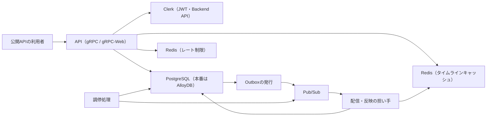

# X クローン バックエンドのテスト戦略

この資料は、これから X クローンのバックエンドを Go で実装する3〜6人のチームのためのものです。変更ごとに「どの失敗を、どのレベルとサイズで確かめ、どこへ重ねないか」を決めるときに読みます。このあとのシナリオ設計と探索計画も、配分はこの資料で決めます。

最も重い失敗は二つあります。ホームタイムラインに見えるポストを誤ること（省く、外した相手を出す、一部だけを正常として返す）と、成立したポストやフォロー変更の反映を失うことです。業務の判断は、単一プロセスで完結する Small のテストで網羅します。実ストレージの制約、非同期処理の冪等性、キャッシュと一次データの合成は、localhost の実物の PostgreSQL、Redis、Pub/Sub エミュレーターを使う Medium のテストで確かめます。複数プロセスをまたぐ接続だけを、4本の Large の E2E に残します。差し替えるのは、Clerk と Google の境界、時計、ポストIDの採番の三つだけです。

リポジトリにはまだコードもテストも CI もないので、以下の「現状」は観測した資料だけを指し、それ以外はすべて目標です。grill では利用者の代わりに答えたため、推奨を仮置きした論点は決定として書かず、「未決と仮説」に集めました。

## 現状: 要件と設計資料だけがあり、テストの対象になるコードはまだ無い

`target-repo` の履歴は、commit 858a38b「docs: 要件と設計資料」の一つだけです。あるのは、`docs/requirements/` の要件3本（バックエンド要件、非機能要件、利用規模と負荷モデル）と、`docs/design/` の設計資料です。設計資料は、アカウント、ポスト、フォロー、ホームタイムライン、ユーザータイムラインの業務知識5本、アカウント、ポスト、フォローのコマンドデータモデル3本、アカウント、フォロー、ホームタイムライン、ユーザータイムラインのクエリデータモデル4本、ユーザージャーニー3本からなります。

Go のコード、Protocol Buffers の定義、テスト、ローカルの完了判定の入口（Makefile など）、CI の設定、docker compose の定義は、どれもありません。したがって、既存テストの分類、実行時間、不安定なテストは観測できず、この資料には書きません。

非機能要件の「負荷保護」と「信頼性」には、「現在の実装」は接続プールの上限（`POSTGRES_WRITE_MAX_CONNS`、`POSTGRES_READ_MAX_CONNS`）だけで一次データへの到達量を抑えている、という記述があります。しかし、その実装はリポジトリにありません。この資料では、これを観測した現状ではなく、設計の意図として扱います。

要件と設計資料から読み取れる目標の構成は、次のとおりです。公開 API は gRPC と、同じ定義から作る gRPC-Web で提供します（非機能要件「移植性と開発環境」）。ポストとフォロー変更は、業務の状態、成立したイベント、後続処理の要求（Outbox）を同じトランザクションで確定した時点で成功します。そのあと、配信の担い手が Pub/Sub を経由して Redis のホームタイムラインキャッシュへ非同期に反映します（バックエンド要件「操作の成功境界」）。調停処理は、止まった要求を拾い直します。認証は、Clerk のセッション JWT と Clerk Backend API で行います（非機能要件「セキュリティ」）。

図のうち、テストで差し替えてよいのは Clerk だけです。それ以外の部品は、ローカルと CI で実物を起動して使います。

## 差し替えるのは Clerk と Google の境界、時計、ポストIDの採番だけにする

古典派を基本にします。テストは公開された振る舞いと外から観測できる結果を確かめ、内部の呼び出しの列を期待値にしません。差し替えてよいのは、制御できない外部の境界、時計、採番だけです。この線は、差し替えた偽物と実物の違いに欠陥が隠れ、テストが緑のまま本番で落ちるのを防ぐために引きます。遅いという理由では、実物を代わりのものに替えません。遅さは、サイズと CI の段階で扱います。

Clerk と Google は、このチームが制御できない外部の境界です。そこで Small と Medium では、ローカルで生成した鍵で署名した JWT を使い、Clerk Backend API は要求と応答の形で差し替えます。差し替えるときは、署名、発行者、audience または authorized party、有効期限の検証は、バックエンドの実物のコードを通します。Google に対しては、バックエンドは Clerk を通してしか接続しません。そのため、Google を直接差し替える箇所はありません。一方、非機能要件の「まだ決まっていないこと」は、GoogleアカウントIDと検証済み状態の正確な項目を「公式仕様と契約テストで確定する」としています。自作の差し替えだけでは、この項目名と鍵の取得の配線を確かめられません。そこで、Clerk の開発用 instance に接続する契約テストを別に持ちます（決定 D2）。その実行の枠と時点は、仮説 H2 に置きました。

時計を差し替えるのは、次の値を決定的に確かめるためです。回収のリース5分、調停の対象にする5分、構造化 Error ログを出す30分、レート制限の秒・分・時・日の時間窓、JWT の `exp`、署名検証済み claim のキャッシュ期間です。テストの中で固定の時間を待つ書き方は、時計を制御できていない症状なので使いません。

ポストIDの採番を差し替えるのは、ポストIDの順とポストした日時の順が食い違う場面（ホームタイムラインの業務知識 BDD-008、ユーザータイムラインの業務知識 BDD-005）を作るためです。本番は UUIDv7 で、要件は、IDの大小が受付順や `created_at` の順と一致することを保証しません（バックエンド要件「ホームタイムラインを見られる」）。テストでは、大小を指定したIDを採番の差し替えで渡します。

PostgreSQL、2用途の Redis、Pub/Sub エミュレーター、配信の担い手、調停処理は、差し替えません。非機能要件「移植性と開発環境」は、これらを docker compose で本番と同じプロセス境界として起動できることを求めているので、テストでも同じ実物を使えます。本番の AlloyDB と、ローカルの PostgreSQL の違いは確かめません。本番クラウドの構築が初期完了に含まれないためで、残るリスクとして「未決と仮説」に書きました。

## サイズは使う資源で決める

サイズはテストの種類の別名ではなく、実際に使う資源と隔離の範囲で決めます。

| サイズ | 使ってよい資源 | このリポジトリの代表的な対象 |
|---|---|---|
| Small | 単一プロセスの中だけ。ネットワーク、外部ストレージ、外部ファイルシステムを使わない | 本文の検証、フォローできるかの判断、配信経路の判定、ページの境界の計算 |
| Medium | 単一マシンの中。localhost の PostgreSQL、Redis、Pub/Sub エミュレーターを使える | 永続化と制約、Outbox の回収と調停、キャッシュへの反映、タイムラインの読み取り、公開 API のハンドラー |
| Large | 複数プロセスの協調（API、発行、配信の担い手、調停処理を別プロセスで起動）、または Clerk の開発用 instance のような制御できない境界 | ユーザージャーニーの主経路の E2E、停止後の再開、Clerk の契約テスト |

公開 API のテストでも、ハンドラーをテストのプロセス内で呼び、localhost の PostgreSQL と Redis を使うなら Medium です。docker compose で起動した API のプロセスへ要求を送り、別プロセスの配信の担い手の結果を読むなら Large です。E2E という名前だけで Large にはしません。実行時間は、実装を始めてから計測する結果であり、サイズの定義には使いません。

## テストレベルごとの責務

このリポジトリで使うレベルと、それぞれが主に確かめることは次のとおりです。表を読むときは、新しいテストを書く前に、確かめたい失敗が「主に確かめること」のどの行に当たるかを探し、そこより上のレベルへ同じ例を重ねていないかを確かめてください。

| レベル | 主に確かめること | 主担当にしないこと | 主なサイズ |
|---|---|---|---|
| 業務判断 | 本文の成立条件、フォローの成立条件と拒否理由、フォロー上限、配信経路の判定、タイムラインの表示対象の論理定義 | 永続化、通信の表現、配線 | Small |
| 永続化 | 一意制約、同じトランザクションでの確定、楽観ロックの版、イベント列と現在状態の一致、フォロワー範囲の走査、本文の往復 | 業務条件の全組み合わせ | Medium |
| 非同期処理と調停 | 回収とリース、範囲の決定と完了、成功の記録、同じメッセージの再処理での冪等、キャッシュへの配置、古い更新の拒否、作り直し | 配信の配線、Pub/Sub の購読設定 | Medium |
| 読み取り（タイムラインと利用者一覧） | キャッシュ、高ファンアウト投稿者の閲覧時合成、一次データの読み取りを統合した表示対象と並び、カーソル、不完全な結果を正常にしないこと | 業務判断の拒否理由 | Medium |
| 公開インターフェース | 認証主体の決定、未登録者の拒否、他人としての操作の拒否、入力の変換、成功と失敗の表現、ページング、レート制限、秘密情報をログと応答へ出さないこと | 業務条件の網羅、保存の実装 | Medium |
| 契約 | Protocol Buffers の定義の互換性、gRPC-Web への生成差分、Clerk の JWT と Backend API の項目 | 全体の配線 | 静的検査、Large |
| E2E | 公開 API から Outbox、Pub/Sub、配信の担い手、Redis、読み取りまでの接続と、停止後の再開 | 境界値の総当たり、全拒否理由 | Large |
| 静的検査 | format、lint、型、Protocol Buffers の lint と破壊的変更の検出、生成コードの差分、禁止依存 | 実行時の意味 | 静的検査 |

業務判断のレベルは、ドメインモデルの形に限りません。本文の検証、フォローの可否、配信経路の判定のように、業務上の結果を持つ関数であれば、このレベルに当てはまります。

## 品質リスクと、その主担当

品質リスクは、機能の一覧からではなく、起こり得る失敗から立てました。主担当は、欠陥が混入した層ではなく、同じ失敗を公開された振る舞いとして再現できる最小の境界に置きます。次の表の「根拠」は、失敗が許されないと決めている資料の節です。

| リスク | 起こる失敗 | 主担当のレベル | サイズ | 根拠 |
|---|---|---|---|---|
| R1 | 他人としてポスト、フォロー、フォロー解除ができる。他人のホームタイムラインを読める。未登録者が業務 API を使える | 公開インターフェース | Medium | 非機能要件「セキュリティ」、バックエンド要件「利用者と権限の範囲」 |
| R2 | 同じ Google アカウントから利用者が二人生まれる。メールアドレスで統合する。利用者とひも付けの片方だけが残る | 永続化（同時登録と片方だけ）、業務判断（統合しない） | Medium、Small | アカウントの業務知識「常に守られること」、アカウントのコマンドデータモデル「並行実行で必要な保証」 |
| R3 | Clerk の項目を誤読し、Google 以外の方法での登録や、検証されていない Google アカウントでの登録を通す。Clerk Backend API の停止時に登録を成功させる | 公開インターフェース（差し替え）、契約（実物） | Medium、Large | 非機能要件「セキュリティ」「信頼性」「まだ決まっていないこと」 |
| R4 | 本文の長さや空白の判定を誤る。受け付けた本文の前後の空白や文字が変わる | 業務判断（判定）、永続化（往復） | Small、Medium | ポストの業務知識「本文」「文字数」「空白」 |
| R5 | ポストが成立したのに、成立の事実か配信の要求が欠ける。拒否した操作で行が増える | 永続化 | Medium | 非機能要件「信頼性」、ポストのコマンドデータモデル BDD-001 |
| R6 | 重複フォロー、自分へのフォロー、5,000人を超えるフォローが成立する。同時の要求で制約が破れる | 業務判断（条件）、永続化（同時実行） | Small、Medium | フォローの業務知識「常に守られること」「同時に起きたとき」 |
| R7 | 配信経路を誤る（9,999人と1万人の境界、一度移った投稿者が戻る） | 業務判断（判定）、永続化（受付時の人数） | Small、Medium | ポストのコマンドデータモデル BDD-004〜006 |
| R8 | 未完了の配信・反映の要求が失われる。二つの担い手が同じ要求を届ける。範囲の一部を残したまま成功にする | 非同期処理と調停 | Medium | 非機能要件「整合性と鮮度」「データの保持」、ポストとフォローのコマンドデータモデル |
| R9 | 同じメッセージの再処理で、同じポストがホームタイムラインに二件並ぶ。古い更新が現在のフォロー関係と矛盾したまま入る。フォロー解除後に古いポストで補充する | 非同期処理と調停 | Medium | バックエンド要件「成立した事実の説明と回復」、非機能要件「整合性と鮮度」 |
| R10 | ホームタイムラインの表示対象か並びを誤る（省く、外した相手を出す、500件で打ち切る、ページが重なる、経路ごとに順序が違う） | 読み取り | Medium | ホームタイムラインの業務知識、クエリデータモデル、非機能要件「負荷保護」 |
| R11 | 一次データや対象全体を評価できないのに、一部だけを正常な結果として返す。正しい0件と障害を区別しない | 読み取り | Medium | バックエンド要件「不完全な読み取り」、非機能要件「負荷保護」 |
| R12 | キャッシュ全体を失った後に、現在の関係と違う結果へ作り直す。同じ利用者の作り直しが同時に二つ進む | 非同期処理と調停 | Medium | バックエンド要件「成立した事実の説明と回復」、非機能要件「負荷保護」 |
| R13 | ユーザータイムラインで他人のポストが混ざる、打ち切られる。存在しない利用者を0件として返す | 読み取り | Medium | ユーザータイムラインの業務知識、クエリデータモデル |
| R14 | 利用者一覧で、本人・フォロー中・フォローしていないの区別を誤る | 読み取り | Medium | フォローの業務知識「フォローする相手を探す」、クエリデータモデル |
| R15 | レート制限の時間窓、操作の数え方を誤る。判定が止まったときに書き込みを通す | 公開インターフェース | Medium | 非機能要件「負荷保護」「信頼性」 |
| R16 | API、Outbox、Pub/Sub、配信の担い手、Redis、読み取りの接続が欠け、成立した変更がどこにも届かない。配信が止まった後に再開しない | E2E | Large | バックエンド要件「初期完了の判断」 |
| R17 | 公開 API の定義が、利用者に黙って互換性を失う | 静的検査 | 静的検査 | バックエンド要件「技術と開発の制約」 |
| R18 | JWT、GoogleアカウントID、メールアドレス、Clerk secret がログかエラー応答に出る | 公開インターフェース | Medium | 非機能要件「セキュリティ」 |
| R19 | 手元と CI で検査の集合がずれ、遅いテストのせいで実行されなくなる | 完了判定の入口 | — | 判断基準「CI は、ローカルの完了判定と同じ入口を呼ぶ」 |

表のうち、R10 と R8・R9 は、主担当の決め方で結果が最も変わるので、以下に詳しく書きます。

### ホームタイムラインは、クエリデータモデルの論理定義と突き合わせて判定する（仮説 H3）

ホームタイムラインの読み取りは、一つの経路では決まりません。直近のページはホームタイムラインキャッシュから読みます。フォロー中の高ファンアウト投稿者（最大5,000人）のユーザータイムラインキャッシュは、100キーずつ取得して閲覧時に合成し、各バッチで新しい側の最大51件だけを残します。キャッシュより古いページは一次データから読みます（非機能要件「負荷保護」、利用規模と負荷モデル「キャッシュ容量の暫定仮定」）。経路の組み合わせが多いので、例を並べるだけでは覆えません。

一方、ホームタイムラインのクエリデータモデルは、`posts` と `follows` だけで表示対象と並びが決まる論理定義を持っています。そこで、この定義を判定の基準にします。キャッシュと合成を通った結果が、同じ PostgreSQL の状態に論理定義を当てた結果と一致するかを、Medium で確かめます。判定基準そのものの正しさは、クエリデータモデルの BDD-001〜009 を固定の場面にして確かめます。そのうえで、固定の種から生成したフォロー、フォロー解除、ポストの状態（高ファンアウト投稿者、500件を超える履歴、ページの境目を含む）で、キャッシュ経路と論理定義を突き合わせます。種は失敗したときに再現できるよう、テストの出力に残します。

非同期反映の時間差は、このテストに持ち込みません。反映を済ませた状態（配信の担い手の処理をテストのプロセス内で最後まで実行した状態）で突き合わせます。反映の遅れを許すのは要件が認めた仕様で、反映後の結果が正しいかとは別の失敗だからです。

### 非同期の冪等性と調停は、担い手の処理をテストのプロセス内で呼んで確かめる

同じメッセージが複数回届く（バックエンド要件「ポストできる」）、担い手が途中で止まる、リースが切れて別の担い手が拾う、という失敗は、Pub/Sub を通さなくても、担い手の処理を実物の PostgreSQL と Redis に対して二度呼べば再現できます。そのため主担当は Medium の「非同期処理と調停」に置き、Pub/Sub の再配送を E2E で待つことはしません。リースの5分と調停の5分は、時計を進めて確かめます。

ポストとフォローのコマンドデータモデルは、回収、範囲の決定、範囲の完了、成功を、行の Before と After で示しています（ポストの BDD-007〜013、フォローの BDD-008〜011）。これらは、そのまま Medium の場面として使えます。

### 同時実行の保証は、実行順を固定したテストで確かめる

フォローの5,000人上限、同じ相手への重複フォロー、同じ Google アカウントからの同時登録、同じ要求の同時回収は、どれも「先に記録された一つだけが成立する」ことが保証です（各コマンドデータモデル「並行実行で必要な保証」）。これをロック待ちの偶然に任せたテストにはしません。先に一方を確定させ、後の一方を古い読み取り（古い版、上限直前の人数）から記録させる順序を、明示的に作ります。並行に動かす必要があるなら、バリアで順序を固定します。

5,000人上限は、一つの行ではなく、フォロワーの `following` の行の集まりにまたがる制約です（フォローのコマンドデータモデル BDD-006）。実装がどの仕組みで守るかにかかわらず、4,999人の状態から二つのフォローを順序を固定して進め、5,000人を超えないことを観測します。

## 重ねないこと

同じ具体例は、下位のレベルが意味の正しさを、上位のレベルが接続の成立を確かめる、と説明できるときだけ、複数のレベルに置きます。このリポジトリでは、次の重複を作りません。

本文の境界値（0文字、1文字、280文字、281文字、コードポイントで数える絵文字、全角空白と改行だけ）は、業務判断の Small に置きます。公開 API のテストでは、拒否が「引数の誤り」として表現されることを、一つの例（たとえば281文字）で確かめるだけにします。フォローの拒否理由（自分、未登録、フォロー中、上限）も同じで、全組み合わせは Small に置き、公開 API では拒否理由ごとの表現の対応を一例ずつ確かめます。

認証と認可（R1）は、公開インターフェースのテストで、すべての業務 API に対して一度ずつ確かめます。業務判断と永続化のテストでは、認証主体は決まった値として渡し、本人確認を繰り返しません。

E2E では、境界値、拒否理由、上限、レート制限、キャッシュの500件境界、高ファンアウトの合成を確かめません。それらはすべて Medium 以下が主担当で、E2E は接続が成り立つかだけを見ます。

探索、運用、本番障害で見つかった欠陥も、見つかったときの操作の列を、そのまま回帰テストにはしません。依存を一つずつ外して、欠陥が消えた境界を主担当にします。

## 設計資料の例をどのレベルで確かめるか

設計資料の BDD は書き換えず、どの例がどのレベルで最も価値を持つかを仕分けます。規則の意味を理解するための最小の例は資料に残すべきもので、網羅が目的の組み合わせは、変更ごとのテスト設計へ送ります。

### アカウント

業務知識の BDD-001（初回登録）と BDD-003（二度目の登録を拒む）は、永続化の Medium で、利用者、登録の事実、ひも付けが同時に増えるか、何も増えないかを確かめます。コマンドデータモデルの BDD-001〜003 と対応します。BDD-002（メールアドレスが同じでも別の利用者）は、永続化では BDD-001 と同じ行の変化にしかなりません。そのため、メールアドレスを判断に使わないことを、業務判断の Small で一例確かめます。

BDD-004（LINE では登録できない）、BDD-005（本人確認されていない Google アカウント）、BDD-008（LINE ではログインできない）は、Clerk が返す情報で決まります。そこで、Clerk の差し替えを使う公開インターフェースの Medium で確かめ、実際の項目名は Clerk の契約テストで確かめます。BDD-006、BDD-007、BDD-009（ログインで利用者が決まる、未登録なら利用者として扱わない、他人の利用者IDを名乗っても効かない）は、公開インターフェースの Medium に置きます。BDD-010（同時登録）は、コマンドデータモデル BDD-002 の行の組を使い、順序を固定した永続化の Medium で確かめます。

### ポスト

業務知識の BDD-002〜007（本文の境界と空白）は、業務判断の Small に置き、表にまとめます。同値クラスは、成立する長さ、長すぎる長さ、空、空白だけ、コードポイントと見た目の文字数が違うものです。BDD-008（前後の空白を保つ）は、Small の判定に加えて、PostgreSQL へ保存して読み戻しても変わらないことを Medium で一例確かめます。後者は、文字列の正規化や前後の空白の除去が保存の層で起きる欠陥を捕まえるためです。BDD-001 と BDD-009 は、コマンドデータモデルの BDD-001 と BDD-003 として永続化の Medium に置きます。BDD-010 と BDD-011（他人として、未登録者として）は、公開インターフェースの Medium に置きます。

コマンドデータモデルの BDD-004〜006（配信経路）は、判定の規則（人数と、これまでの要求の経路）を Small で確かめます。受け付けた時点の人数が同じトランザクションで数えられることは、Medium で1万人ちょうどの一例だけ確かめます。BDD-007〜013（回収、範囲、成功）は、非同期処理と調停の Medium に置きます。

### フォロー

業務知識の BDD-001〜013 は、業務判断の Small で、フォロー中の相手の顔ぶれと人数から可否を判断する規則として確かめます。4,999人と5,000人の境界（BDD-002、BDD-003、BDD-013）もここに置きます。BDD-007 と BDD-012（他人として）は、公開インターフェースの Medium に置きます。BDD-014〜016（同時に起きたとき）は、コマンドデータモデルの BDD-005〜007 の行の組を使い、順序を固定した永続化の Medium で確かめます。BDD-017（相手を探す一覧）は、クエリデータモデルの BDD-001〜002 と合わせて、読み取りの Medium に置きます。

### ホームタイムライン

業務知識とクエリデータモデルの BDD-001〜009 は、判定基準（論理定義）の固定の場面であり、キャッシュ経路の固定の場面でもあります。どちらも Medium に置きます。業務知識の BDD-010（500件を超えても最初のポストまで）は、キャッシュと一次データの境目をまたぐので、Medium で確かめる価値が最も高い例です。BDD-011（他人のホームタイムライン）は、公開インターフェースの Medium に置きます。

### ユーザータイムライン

業務知識の BDD-001〜005 と BDD-007、クエリデータモデルの BDD-001〜007 は、読み取りの Medium に置きます。高ファンアウト投稿者のユーザータイムラインキャッシュは、読み取りを助ける派生データにすぎません（バックエンド要件「ユーザータイムラインを見られる」）。そのため、キャッシュがある場合とない場合で結果が同じになることを、同じ場面で確かめます。BDD-006（未登録者）は、公開インターフェースの Medium に置きます。

### ユーザージャーニー

3本のジャーニーの主経路は、E2E の候補です（仮説 H4）。分岐のうち、フォロー上限、操作回数の上限、本文の拒否、フォローしていない相手の解除の拒否は、それぞれ Small か Medium が主担当です。E2E には入れません。反映がまだ済んでいない分岐は、要件が許す時間差の説明です。テストでは、反映が済むまでを期限付きで待つ条件として使い、「一時的に見えないこと」は期待値にしません。

### 資料の持ち主への提案

資料は書き換えず、次を持ち主へ提案します。どれも、境界シナリオを具体値で書く前に解けていると、シナリオ設計の手戻りが減ります。

- ホームタイムラインキャッシュ、高ファンアウトのユーザータイムラインキャッシュ、フォロー関係の版、作り直し中の保留データ、配信の範囲の区切り方を具体例で示す設計資料が無い。利用規模と負荷モデルとポストのコマンドデータモデルは、これを物理設計へ申し送っている。R9、R10、R12 の境界シナリオの前提になるので、作成を提案する（仮説 H6）。
- 公開 API の契約（Protocol Buffers の定義、失敗の表現、利用者一覧の件数と続きの読み方）が無い。フォローのクエリデータモデル「未決」も、件数と続きの読み方を API の契約へ送っている。
- 3本のユーザージャーニーは、要件を `../../input/バックエンド要件.md` と `../../input/非機能要件.md` へリンクしているが、要件は `docs/requirements/` にあり、リンクが切れている。
- ユーザータイムラインの業務知識、ポストとアカウントのコマンドデータモデルは、ほかの持ち主の資料が「まだ置かれていない」ので照合していない、と書いている。いまはすべて置かれているので、照合をやり直すよう提案する。照合する点の例として、ポストとフォローのコマンドデータモデルは `followee_user_id` を使うが、利用規模と負荷モデルの索引は `(followed_user_id, follower_user_id)` と書いている。
- 非機能要件の「現在の実装」の記述は、リポジトリにまだ無い実装を指している。実装ができるまでは設計の意図として読めるよう、書き方の見直しを提案する。

## 境界シナリオは、公開 API、配信のメッセージ、調停と作り直しに作る

他のコンポーネントが依存する境界は、三つあります。フロントエンドと外部の利用者が使う公開 API、配信と反映を運ぶ Pub/Sub のメッセージ、そして調停処理と作り直しの処理です。この三つには、テストコードとも業務知識の写しとも別に、境界シナリオを作ります。入力の同値クラスと境界値は表にまとめ、状態、再送、順序、競合で初めて差が出るものは具体的なシナリオにします。「不正な値」とは書かず、外した条件と具体値を書きます。

公開 API では、認証主体の決め方（未登録、他人の利用者IDを名乗る、期限切れの JWT）、失敗の表現（引数の誤り、権限なし、対象なし、上限、過負荷、一次データに届かない）、カーソルの排他的な境界を、シナリオにします。配信のメッセージでは、同じメッセージの二度の到着、リース切れの後の再回収、範囲の途中での停止、キャッシュが無いフォロワーへの配信を、シナリオにします。調停と作り直しでは、5分進捗が無い要求の再処理、30分を超えた要求の Error ログ、作り直し中に新しいポストかフォロー変更が成立した場合のやり直しを、シナリオにします。

安全上限（一リクエストのデータ量とメモリ量、同時合成数、判定が止まったときのプロセス内の上限）は、値が決まっていません（非機能要件「まだ決まっていないこと」）。値そのものは負荷試験で決めます。テストでは、小さな値を設定で与え、「上限を超えたら部分結果ではなく過負荷エラーを返す」という振る舞いだけを Medium で確かめます。

## E2E に残すのは4本の接続だけ（仮説 H4）

Large の E2E は、docker compose で API、Outbox の発行、配信・反映の担い手、調停処理、PostgreSQL、2用途の Redis、Pub/Sub エミュレーターを別プロセスで起動し、公開 API だけで操作と観測を行います。Clerk は差し替えます。残すのは、複数プロセスの配線と非同期の協調が欠けると再現しない、次の4本だけです。

1. 「自分のポストをフォロワーに届ける」の場面1→4。ポストの成功から、フォロワーのホームタイムラインに同じポストが一件だけ並ぶまで。
2. 「読みたい相手をフォローしてホームタイムラインで読む」の場面3→5→6。フォローの成功から、フォロー前の120件が3ページ（50件、50件、20件）で重ならずに読めるまで。
3. 「読まなくなった相手のポストをホームタイムラインから外す」の場面1→3。フォロー解除の成功から、外した相手のポストが過去分も新しい分も消え、ほかのポストが残るまで。
4. 配信の担い手を止めたままポストが成功し、担い手を再開すると、そのポストがフォロワーのホームタイムラインに届くまで（バックエンド要件「失敗と回復」）。

どの E2E も、固定の時間を待ちません。公開 API の読み取りで観測できる条件（ホームタイムラインに対象のポストが並ぶ、並ばなくなる）が成り立つまでを、期限付きで待ちます。期限を過ぎたら失敗にし、その時点の Outbox と回収の状態を診断用に出力します。失敗した E2E を、無条件に再実行して緑にはしません。

## 完了判定の入口を一つにし、CI はそれをそのまま呼ぶ（仮説 H5）

手元で通ったことと、CI で通ったことが、同じ検査の集合を指すようにします。ローカルの完了判定の入口を一つのコマンドにし、CI はそれをそのまま呼びます。入口の中の順は、静的検査、Small、Medium、Large（Clerk の契約テストを除く）です。前の段階が落ちたら、後の段階は実行しません。安い検査で先に止めるためです。

Large も入口に含めます。非機能要件「移植性と開発環境」は、開発者のノートPCと Codespaces で本番と同じプロセス境界を起動できることを求めており、Large も秘密値なしでローカルに再現できるからです。build tag などで、既定の実行から黙って外すことはしません。

Clerk の契約テストだけは、Clerk の開発用 instance の秘密値とネットワーク接続が要るので、入口から外します。その代わり、Clerk の SDK か版を変える変更のときと、定期に、秘密値を置いた別の実行場所で実行します（仮説 H2）。秘密値を置く場所と接続の許可を誰が持つかは、まだ決まっていません。

実行時間の観測値は無いので、段階ごとの時間の上限は決めません。最初の実装で、段階ごとの実行時間、並列化の単位、失敗したときに原因の特定にかかる手間を計測し、それをもとに段階の分け方を見直します。

## 詳細化しない品質領域

性能は、この戦略では詳細化しません（決定 D1）。バックエンド要件は、日間利用者150万人を再現する負荷試験を初期完了に含めず、非機能要件も応答時間の目標値を未決にしているからです。後続の負荷試験に要る入力は、利用規模と負荷モデルの設計基準、1秒バースト、平均配信先200人、高ファンアウト境界1万人です。この戦略が負荷試験のために残す観測点は、非機能要件「運用性と観測」が挙げる、配信の滞留、未発行の要求の件数と最古の経過時間、構造化ログです。

セキュリティ診断と探索的テストも、別に扱います（仮説 H1）。どちらも、目的、環境、合否が機能テストと違うためです。認証と認可の機能的な振る舞い（R1、R3）と、秘密情報を出さないこと（R18）は、この戦略の公開インターフェースのテストに残します。探索の計画は、自動テストの証拠がそろってから、残るリスク（反映の遅れの見え方、高ファンアウトへの昇格の瞬間、キャッシュ全体を失った直後の一斉閲覧）へ配分します。

## 未決と仮説

grill の問いに答える利用者がいなかったため、次の仮説は推奨を仮置きしたものです。どれも決定ではありません。

- H1 セキュリティ診断と探索的テストを、この戦略で詳細化しない。根拠は、判断基準がこれらを別に扱う領域としていることである。採らなかった案は、認証の攻撃経路を戦略のリスクに含める案である。利用者がセキュリティを中心の対象に指定すれば、確定し直す。
- H2 Clerk の契約テストを Large として完了判定の入口から外し、SDK か版を変えるときと定期に実行する。根拠は、秘密値とネットワークが要り、手元の完了判定を外部の都合で止めないためである。採らなかった案は、入口に含めて毎回実行する案と、契約テストを置かず差し替えだけにする案である（後者は、非機能要件が契約テストで項目を確定するとしているので採れない）。Clerk の開発用 instance で、Google の外部アカウントを持つ試験用の利用者を自動で用意できるかを確かめれば、確定する。用意できなければ、契約テストの範囲は JWT の検証と Backend API の応答の形に狭まり、Google の検証済み状態の項目は手動の確認に残る。
- H3 ホームタイムラインの判定基準を、クエリデータモデルの論理定義にし、固定の種で生成した状態でキャッシュ経路と突き合わせる。根拠は、経路の組み合わせが例だけでは覆えないことである。採らなかった案は、設計資料の例だけを固定の場面にする案である。キャッシュと配信の設計資料ができ、経路の数が確定したら、生成する状態の範囲を見直す。
- H4 E2E を4本に限る。根拠は、要件の完了条件のうち、プロセスをまたがないと再現しないものがこの4本だからである。採らなかった案は、既知の分岐（上限、反映待ち）も E2E に含める案である。実装後に、下位のテストで捕まらず E2E だけで見つかった欠陥が出たら、経路を足すかを見直す。
- H5 完了判定の入口を一つにして Large まで含め、CI はそれを呼ぶ。根拠は、要件がローカルで本番と同じプロセス境界を起動できることを求めていることである。採らなかった案は、Large を CI の別工程だけで動かす案である。計測した Large の実行時間が、変更のたびに回すには長すぎると分かったら、入口の構成要素と CI の工程の対応を書き、集合の一致を機械で検査する形へ移す。
- H6 キャッシュと配信の設計資料と API 契約が無いまま戦略を確定し、境界シナリオの設計の前に作成を提案する。根拠は、主担当のレベルとサイズは観測できる結果で決まり、キーの構造には依らないことである。採らなかった案は、資料がそろうまで戦略を止める案である。資料ができたら、R9、R10、R12 の主担当が変わらないかを確かめる。

仮説とは別に、次のリスクは確かめないまま残ります。

- 本番の AlloyDB と、ローカルの PostgreSQL の違いによる欠陥は、確かめない。本番クラウドの構築が初期完了に含まれないためである。本番構成を作る段階で、確かめ方を決める。
- 設計資料そのものの未決（制御文字だけの本文を受け付けるか、ホームタイムラインでポストした日時を見せるか、同じ投稿者の二件のポストが同時に1万人の境界を越えたときの経路）は、テストの期待値を変える。決まるまでは、資料が仮に置いた値でテストを書き、決まったら該当する Small と Medium の例を直す。
- 反映の99%を5分以内とする運用 SLO は、テストの合否にしない。一件ごとの期限ではなく、達成率を集計する仕組みも初期リリースの対象外だからである（非機能要件「整合性と鮮度」）。
