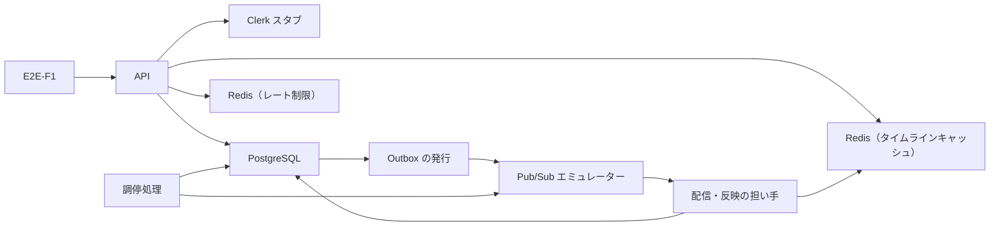

# 「読みたい相手をフォローしてホームタイムラインで読む」の E2E シナリオ

この資料は、X クローンのバックエンドを実装する3〜6人のチームが、ユーザージャーニー「読みたい相手をフォローしてホームタイムラインで読む」の価値経路に、どの E2E を一本だけ持つかを決めるためのものです。E2E に残すのは、利用者 A が利用者 B をフォローしてから、B がフォロー前にしたポストを A が自分のホームタイムラインで最後まで読めるまでの一本（E2E-F1）です。この一本で確かめるのは、フォロー反映の配線（Outbox から配信・反映の担い手、タイムライン用の Redis、API の読み取りまで）が別々のプロセスの間でつながっているかどうかです。業務の正しさは確かめません。

シナリオの形は、[テスト戦略](../test-strategy/test-strategy.md)の「E2E に残すのは4本の接続だけ（仮説 H4）」の2を具体化したものです。ただし、戦略が書いた「フォロー前の120件を3ページ（50件、50件、20件）で読む」は、そのままでは担い手の欠陥を検出できません。また、本番と同じレート制限のもとでは120件を作れません。そのため、この資料では開始状態と件数を変えました。その理由は下の節に書きました。開始状態、件数、待つ期限、Clerk の差し替え方の四つは、問いに答える利用者がいなかったため推奨を仮置きしたものです。フォロー反映が通るプロセスの並びと公開 API の契約も決まっていません。そのため、この資料の status は unresolved です。リポジトリ（HEAD は commit 8a351c1）には、要件と設計資料のほかにコード、テスト、API の定義がまだ無いので、このシナリオは実装も実行もされていません。

## この経路で E2E に残すのは、フォロー反映が読み取りまで届くかの一本だけ

ジャーニーの場面と分岐のうち、実構成でしか欠陥が出ないのは、場面3（フォローする）から場面5、6（ホームタイムラインで読む）へ、非同期の反映を経てつながる部分だけです。ほかの場面と分岐は、同じ失敗を単一プロセスか単一マシンで再現できるので、下位のレベルへ置きます。

| ジャーニーの部分 | 担当するレベル | サイズ | 戦略のリスク |
|---|---|---|---|
| 場面1 利用者一覧で相手を見つける | 読み取り | Medium | R14 |
| 場面2 相手のユーザータイムラインを読む | 読み取り | Medium | R13 |
| 場面3→5→6 フォローから反映を経て最後まで読む | E2E（E2E-F1） | Large | R16 |
| 場面4 フォロー上限 | 業務判断、永続化 | Small、Medium | R6 |
| 分岐 操作回数の上限 | 公開インターフェース | Medium | R15 |
| 分岐 反映がまだ済んでいない | 期待値にしない（E2E-F1 の待つ条件として使う） | — | — |
| 分岐 ホームタイムラインを読めない | 読み取り | Medium | R11 |

表では、担当するレベルが E2E の行が一つしか無いことを確かめてください。場面1と場面2は非同期の接続を持たず、一次データの読み取りで完結します。反映がまだ済んでいない分岐は、要件が許す時間差の説明です（バックエンド要件「フォロワーへの反映」）。「一時的に見えない」ことを期待値にすると、反映が速い構成でテストが落ちます。

候補は、戦略と skill の順で比べました。まず目的を果たせないときの影響を見ます。フォローしたのに相手のポストがいつまでも見えなければ、このジャーニーの目的は果たせず、戦略が最も重いとした「ホームタイムラインに見えるポストを誤る」失敗に当たります。次に、下位で検出できない接続の数を見ます。この部分は四つあり、次の節に書きました。

## 実構成でしか見つからない欠陥は四つある

E2E-F1 が捕まえる欠陥は、どれも各部品のコードが単独では正しく、プロセスの間の設定や配線がずれたときに起きるものです。Medium のテストは担い手の処理をテストのプロセス内で呼ぶので（戦略「非同期の冪等性と調停は、担い手の処理をテストのプロセス内で呼んで確かめる」）、これらのずれを再現できません。

一つ目は、認証主体の伝播です。スタブが発行した JWT を API のプロセスが検証して A を決め、その A がフォローの行のフォロワーとホームタイムラインの持ち主の両方に届くことを確かめます。公開インターフェースの Medium は、ハンドラーをテストのプロセス内で呼ぶため、別プロセスの API が受け取る設定（公開鍵の取得先、発行者、audience）のずれを見ません。

二つ目は、フォロー反映の要求が担い手のプロセスへ届く経路です。Outbox に積まれた要求が、発行と Pub/Sub の話題と購読の設定を通って担い手に届くか、または担い手が DB から直接回収するかは、設計資料の間で一致していません（未決 U1）。どちらの形でも、要求を渡す側と受け取る側が別プロセスの設定で結ばれているかぎり、ずれは実構成でしか出ません。戦略も、配信の配線と Pub/Sub の購読設定を、非同期処理の Medium が主担当にしないこととして挙げています。

三つ目は、担い手が書き込む Redis の取り違えです。ローカルの構成には、タイムラインキャッシュ用とレート制限用の2用途の Redis があります（非機能要件「移植性と開発環境」）。担い手の設定がレート制限用の Redis を向いていても、担い手のプロセス内のテストは通ります。

四つ目は、担い手のプロセスが書いたキャッシュを API のプロセスが読み、キャッシュの終わりから一次データへ移って続きを返す読み取りです。キーの名前や並びの値を二つのプロセスが同じ設定で扱っているかは、二つを別に起動して初めて分かります。

同じ業務の例（B のフォロー前のポストが新しい順に並び、ページが重ならない）は、読み取りの Medium にも置かれています（ホームタイムラインのクエリデータモデル BDD-002、BDD-008、BDD-009）。二つは別の欠陥を確かめます。Medium は、表示対象と並びが論理定義どおりかという意味の正しさを確かめます。E2E-F1 は、別プロセスの間で反映と読み取りがつながるかという接続の成立を確かめます。

## E2E-F1: フォローした相手の、フォロー前のポストがホームタイムラインで最後まで読める

### 目的

A が B をフォローしたとき、B がフォロー前にしたポストが、非同期の反映を経て A のホームタイムラインに新しい順に並び、カーソルで最後まで読めることを、本番と同じプロセス境界の構成で確かめます。ジャーニーの完了条件「相手のポストが、フォローする前に作られたものも含めて、自分のホームタイムラインに新しい順に並び、最初のポストまで読み進められた」に当たります。

### 開始状態は、A のキャッシュが1ページ分以上埋まった状態にする（仮説 H-E1）

**ジャーニーの開始状態（A はポスト0件、誰もフォローしていない）のままでは、この E2E は担い手の欠陥を検出できません。** 利用規模と負荷モデル「キャッシュ容量の暫定仮定」は、キャッシュだけで要求ページを満たせないときは一次データから表示資格のあるポストを読む、としています。また、閲覧時にキャッシュ全体が無ければ、API が一次データから作り直します（バックエンド要件「操作の成功境界」）。A のキャッシュが無いか0件なら、担い手が何も反映しなくても、読み取りは一次データから B のポストを正しく返します。そのため、反映の経路が欠けていても E2E は緑になります。

そこで、フォローの前に A のキャッシュを A 自身のポスト50件で満たしておきます。非機能要件「整合性と鮮度」は、キャッシュが無い利用者は次の閲覧で原データから作り直すとしており、担い手がキャッシュの無い利用者へ反映することは前提にしていません。そこで A のキャッシュは、フォローの前の事前の閲覧で API に作り直させます。こうしておけば、フォロー反映が届かないかぎり、A の先頭ページはキャッシュから返る A の50件のままです。B のポストが先頭ページに並ぶのは、担い手が A のキャッシュを更新したときだけになります。フォロー反映が A のキャッシュに B のポストを足す形でも、A のキャッシュを捨てて次の閲覧で作り直させる形でも、担い手が動かなければ先頭ページは変わらないので、この判定は成り立ちます。

開始状態は、速さのために、A と B の利用者の行と105件のポストの行を SQL で PostgreSQL へ直接入れ、A のキャッシュも Redis へ直接書いて作ります。本番の経路に無い準備は、スタブに A と B の Clerk ユーザーを置くことだけです。

B のポストは55件にします（仮説 H-E2）。非機能要件「負荷保護」のポスト作成の上限は5回/秒、60回/時、300回/日で、戦略が書いた120件は、本番と同じ上限のもとでは公開 API で作れません。55件なら上限の内側で作れます。A の50件と合わせた105件で、B のフォロー前のポストが先頭ページを越えて2ページ目まで続くので、カーソルでの続きの読み取りと、キャッシュから一次データへの移り目を通ります。120件でなければ見つからない接続の欠陥はありません。500件の境界は読み取りの Medium が主担当です。

開始時に外から観測できる状態は、次のとおりです。A と B は登録済みで、どちらも誰もフォローしていません。A のポストは50件、B のポストは55件で、テストはどちらもポスト作成の応答からポストIDを記録しています。A がホームタイムラインの先頭を読むと、A の50件だけがポストIDの降順で返り、続きはありません。

### 公開入口と、経由する実コンポーネント

公開入口は、公開 API（gRPC、または同じ定義から作る gRPC-Web）の利用者登録、ポスト作成、フォロー、ホームタイムライン取得の四つです。docker compose で次の部品を別プロセスとして起動し、テストは API のプロセスへ要求を送るだけにします。

図の Outbox の発行と Pub/Sub エミュレーターは、戦略の構成図に従って置きました。フォロー反映がこの二つを通るかどうかは、設計資料の間で一致していません（未決 U1）。調停処理は起動しますが、E2E-F1 の合否には使いません。待つ期限を調停の5分より短くしてあるので、調停が拾い直して間に合うことは起きないからです。

### 差し替えるのは Clerk だけにする（仮説 H-E4）

Clerk はこのチームが制御できない外部の境界なので、docker compose の中に置いたスタブのプロセスで差し替えます。Pub/Sub もエミュレーターの起動が遅いので、担い手へ直接渡すインメモリのキューに差し替えます。スタブは、テストがローカルの鍵で署名した JWT を検証するための公開鍵と、Clerk Backend API の利用者情報（検証済みの Google external account と Google アカウントID）の応答を返します。API は設定でスタブの URL を向きます。JWT の署名、発行者、audience または authorized party、有効期限の検証は、本番のコードを通します。

実物との差は、Clerk が返す項目の名前と形、公開鍵の取得の配線です。非機能要件「まだ決まっていないこと」は、Google アカウントIDと検証済み状態の正確な項目を公式仕様と契約テストで確定する、としています。この差は、Clerk の開発用 instance に接続する契約テスト（戦略の決定 D2、仮説 H2）で確かめ、E2E-F1 では確かめません。時計とポストIDの採番は、E2E-F1 では差し替えません。時間窓を決定的に確かめる必要が無く、期待する並びはポスト作成の応答で返ったIDから計算するからです。

### 価値へ届く最小の操作列

1. スタブに、実行ごとの識別子を接頭辞にした Clerk ユーザーを二つ置き（例: `e2e-f1-<実行ID>-a`、`e2e-f1-<実行ID>-b`）、公開の登録 API で A と B を登録する。
2. A が、本文「e2e-f1 A 001」から「e2e-f1 A 050」までの50件を、5回/秒を超えない間隔でポストし、応答のポストIDを記録する。
3. 2 を終えた後に、B が本文「e2e-f1 B 001」から「e2e-f1 B 055」までの55件を同じ間隔でポストし、応答のポストIDを記録する。
4. A がホームタイムラインの先頭を読み、A の50件だけがポストIDの降順で返り、続きが無いことを確かめる。この閲覧で、API が A のキャッシュを作り直す。
5. A が B をフォローし、成功の応答を受け取る。
6. A が B をフォローしてから30秒待ち、ホームタイムラインの先頭を一度だけ読む。
7. 完了条件が成り立ったら、A がカーソルで続きを読み、続きが無くなるまで読み進める。

期待する並びは、2 と 3 で記録した105件のポストIDを降順に並べて計算します。UUIDv7 のポストIDは、受付順と大小が一致することを保証しないからです（バックエンド要件「ホームタイムラインを見られる」）。ID が受付順に並んだときの期待は、先頭ページが B の新しい方から50件（B 055〜B 006）、2ページ目が B の残り5件（B 005〜B 001）と A の新しい方から45件（A 050〜A 006）、3ページ目が A の残り5件（A 005〜A 001）です。

### 完了の判定は、公開 API の先頭ページで行う（仮説 H-E3）

完了は、操作列の 6 で読んだ先頭ページのポストIDの列が、期待する並びの先頭50件と一致したことで判断します。固定の時間だけ待ってから読む書き方はしません。

期限は60秒、間隔は2秒にします。調停処理は5分間進捗の無い要求を拾い直すので（非機能要件「データの保持」）、期限を5分より長くすると、Outbox の発行が壊れていても調停が拾い直して間に合ってしまいます。そうなると、通常の経路の欠陥が隠れます。調停からの回復は、戦略の E2E の4（配信の担い手を止めたままポストし、再開後に届くまで）が受け持ちます。また、タイムライン閲覧の上限は120回/時なので（非機能要件「負荷保護」）、閲覧の回数を上限の内側に収めます。2秒間隔で60秒なら最大30回で、操作列の 4 の1回と 7 の2回を足しても33回です。99%を5分以内とする運用 SLO は一件ごとの期限ではないので、合否には使いません（非機能要件「整合性と鮮度」）。

### 最終的に観測する結果

操作列の 7 を終えた時点で、A が読んだ3ページを順につなげた列は、期待する105件の並びと一致します。一致するのは、ポストID、投稿者の利用者ID、本文の三つです。三つのページに同じポストIDは二度現れず、3ページ目の後に続きはありません。B の55件はすべてフォロー前に作られたものなので、これで「フォロー前のポストも表示対象になる」（バックエンド要件「フォローできる」）ことが、別プロセスの反映を経て成り立ったと分かります。

フォロー成功の表現、カーソル、続きが無いことの表現は、公開 API の契約がまだ無いため、意味の水準で書きました（未決 U2）。

### データの隔離と後処理

外部のサービスへは接続しないので、共有環境の所有印や、外部への接続の許可は要りません。それでも、同じ docker compose の構成で戦略のほかの E2E と並べて実行できるよう、E2E-F1 は自分で作った A と B だけを読み、全体の件数（利用者一覧の人数など）には依存しません。ホームタイムラインは持ち主ごとに分かれ、B はほかのシナリオの利用者にフォローされないので、ほかのシナリオが A の結果を変えることはありません。

後処理では、実行の終わりに docker compose の volume ごと捨てます。失敗したときは、捨てる前に下の観測点をすべて出力します。自動では再実行しません。再実行すると、最初の失敗の証拠が上書きされるからです（戦略「E2E に残すのは4本の接続だけ」）。

### 失敗の原因を切り分ける観測点

次の観測点は、期限を過ぎたときに読み取り専用で出力するものです。合否の条件にはしません。上から順に見ると、反映が途中のどこで止まったかが分かります。

1. フォローの応答と、`follows` の A から B への行（`status` が `following`、`current_version` が1か）。API のプロセスと PostgreSQL の書き込みがつながったかが分かる。
2. そのフォローの `follow_base_events` の行と、それを指す `follow_change_reflection_requested_events` の行（要求ID）。反映の要求が、フォローと同じ変更で積まれたかが分かる。
3. 発行の記録と、Pub/Sub エミュレーターの購読に残る未確認のメッセージ数。発行の記録の表は、フォローのコマンドデータモデルにまだありません（未決 U1）。
4. `follow_change_reflection_claimed_events` の行（`worker_id`、回収の時刻）と `follow_change_reflection_succeeded_events` の行。担い手が要求を受け取ったか、反映し終えたかが分かる。
5. タイムラインキャッシュ用の Redis にある A のホームタイムラインの件数（105件か）と、レート制限用の Redis に A のタイムラインのキーが紛れていないか。担い手がどちらの Redis へ書いたかが分かる。
6. 各プロセスの構造化ログのうち、観測点の 2 の要求IDを含む行。

観測点の 4 に成功があり、5 が105件なのに先頭ページが変わらないなら、欠陥は API の読み取り側の設定にあります。非機能要件「運用性と観測」が挙げる、未発行の配信要求の件数と最古の経過時間、非同期配信の未処理件数と最古の経過時間が実装されたら、それも出力に加えます。

観測点の限界も一つあります。操作列の 3 で B がしたポストの配信が、操作列の 5 のフォローの成立より後まで遅れると、そのポストは B のフォロワーになった A へ、ポストの配信の経路で届きます。そうなると、フォロー反映が壊れていても、先頭ページが部分的に期待へ近づくことがあります。B のポストの配信が済んだことを公開 API で観測する方法は無いので、この E2E では迂回せず、診断できない不足として残します。失敗したときは、観測点の 4 の成功の有無で見分けます。

### サイズと実行の場所

サイズは Large です。API、Outbox の発行、配信・反映の担い手、調停処理を別プロセスで起動し、別プロセスの担い手の結果を API から読むからです（戦略「サイズは使う資源で決める」）。

秘密値と外部への接続は要らないので、E2E-F1 は戦略の完了判定の入口（仮説 H5）に含め、手元と CI で同じように実行します。実行時間は、最初の実装で計測します。

## 下位で繰り返さない項目

E2E-F1 は、次の項目を確かめません。どれも、同じ失敗を再現できる最小のレベルが主担当です。

| 項目 | 主担当のレベル | サイズ | 戦略のリスク |
|---|---|---|---|
| 表示対象と並びの論理定義、カーソルの排他的な境界、500件の境界、高ファンアウト投稿者の閲覧時の合成 | 読み取り | Medium | R10 |
| 同じメッセージの二度の処理、リースの切れ目、古い更新の拒否 | 非同期処理と調停 | Medium | R8、R9 |
| フォローの拒否理由と5,000人の上限 | 業務判断、永続化 | Small、Medium | R6 |
| フォローと反映の要求が同じ変更で積まれること | 永続化 | Medium | R5 |
| 操作回数の上限 | 公開インターフェース | Medium | R15 |
| 他人としてのフォローと、他人のホームタイムラインの閲覧 | 公開インターフェース | Medium | R1 |
| 一部だけのホームタイムラインを正常にしないこと | 読み取り | Medium | R11 |
| 担い手を止めた後の再開 | E2E（戦略の E2E の4） | Large | R16 |
| ポストのフォロワーへの配信 | E2E（戦略の E2E の1） | Large | R16 |

表の最後の二行は、E2E-F1 と同じ Large の E2E ですが、別の接続を受け持ちます。E2E-F1 に混ぜると、失敗したときにどの接続が欠けたのかを見分けにくくなるので、分けておきます。

## 未決と仮説

次の四つの仮説は、問いに答える利用者がいなかったため推奨を仮置きしたもので、決定ではありません。

- H-E1 A の50件のポストと事前の閲覧で、A のキャッシュを1ページ分以上埋めてからフォローする。根拠は、利用規模と負荷モデル「キャッシュ容量の暫定仮定」の、キャッシュで満たせないページは一次データから読む、という規則である。採らなかった案は、ジャーニーの開始状態をそのまま使う案（担い手の欠陥を検出できない）と、フォロー反映の成功の記録を DB から読んで合否にする案（テストが内部の表の形に依存し、戦略の「公開 API だけで操作と観測」に反する）である。キャッシュと配信の設計資料（戦略の仮説 H6）で、読み取りがキャッシュと一次データのどちらを使うかの規則が確定すれば、確定する。1件以上あるキャッシュなら先頭ページで一次データへ移らない規則に決まれば、A のポストの件数を減らせる。
- H-E2 B のポストを55件にし、レート制限は本番と同じ値にする。根拠は、非機能要件「負荷保護」のポスト作成の上限が60回/時であることと、120件でなければ見つからない接続の欠陥が無いことである。採らなかった案は、120件を保ち、E2E の環境でポスト作成の上限を設定で引き上げる案と、準備専用の経路で開始状態を作る案である。テスト戦略の持ち主が、戦略の E2E の2の件数をこの資料に合わせて改めれば、確定する。ジャーニーどおりの120件を残すと決めた場合は、上限を設定で変えられる設計にするかを先に決める。
- H-E3 2秒ごとに先頭ページを読み、60秒で打ち切る。根拠は、調停が拾い直す5分より短くすることと、タイムライン閲覧の上限120回/時に収めることである。採らなかった案は、5分の SLO に合わせて5分以上待つ案と、固定の時間だけ待つ案である。最初の実装で、ローカルの構成で反映にかかる時間を計測し、未決の調停の周期（非機能要件「まだ決まっていないこと」）が決まったら、確定する。
- H-E4 Clerk は docker compose の中のスタブのプロセスで差し替え、JWT の検証は本番のコードを通す。根拠は、戦略が E2E でも Clerk を差し替え、検証はバックエンドの実物のコードを通すとしていることである。採らなかった案は、Clerk の開発用 instance に接続する案と、テスト用のヘッダーで利用者を指定して検証を迂回する案である。採用する Clerk の SDK で、公開鍵の取得先と Backend API の URL を設定で変えられるかが分かれば、確定する。

次の二つは、推奨を出せないまま残る未決です。

- U1 フォロー反映が通るプロセスの並びが、資料の間で一致していない。フォローのコマンドデータモデルでは、担い手が DB の要求を直接回収する形になっている。一方で、戦略の構成図は Outbox の発行と Pub/Sub を経由する形になっており、利用規模と負荷モデルは「フォローイベント発行要求」「Outbox回収・発行完了」の記録を、まだモデルに含まれていないものとして挙げている。どちらの形かで、経由する実コンポーネントと観測点の 3 が変わる。E2E-F1 の操作と完了条件は変わらない。確かめる相手は物理設計の担当である。
- U2 公開 API の契約（Protocol Buffers の定義、フォロー成功の表現、カーソル、続きが無いことの表現）が無い。最終観測は意味の水準で書いた。API の契約ができたら、具体的な項目に置き換える。

テスト戦略の持ち主へは、戦略の E2E の2の記述（「フォロー前の120件が3ページ（50件、50件、20件）」）を、この資料の開始状態と件数に合わせて改めるよう提案します。改めなければ、戦略とこの資料が別の開始状態を指したままになります。また、戦略の「現状」は対象リポジトリの commit を 858a38b と書いていますが、観測した HEAD は 8a351c1 でした。
